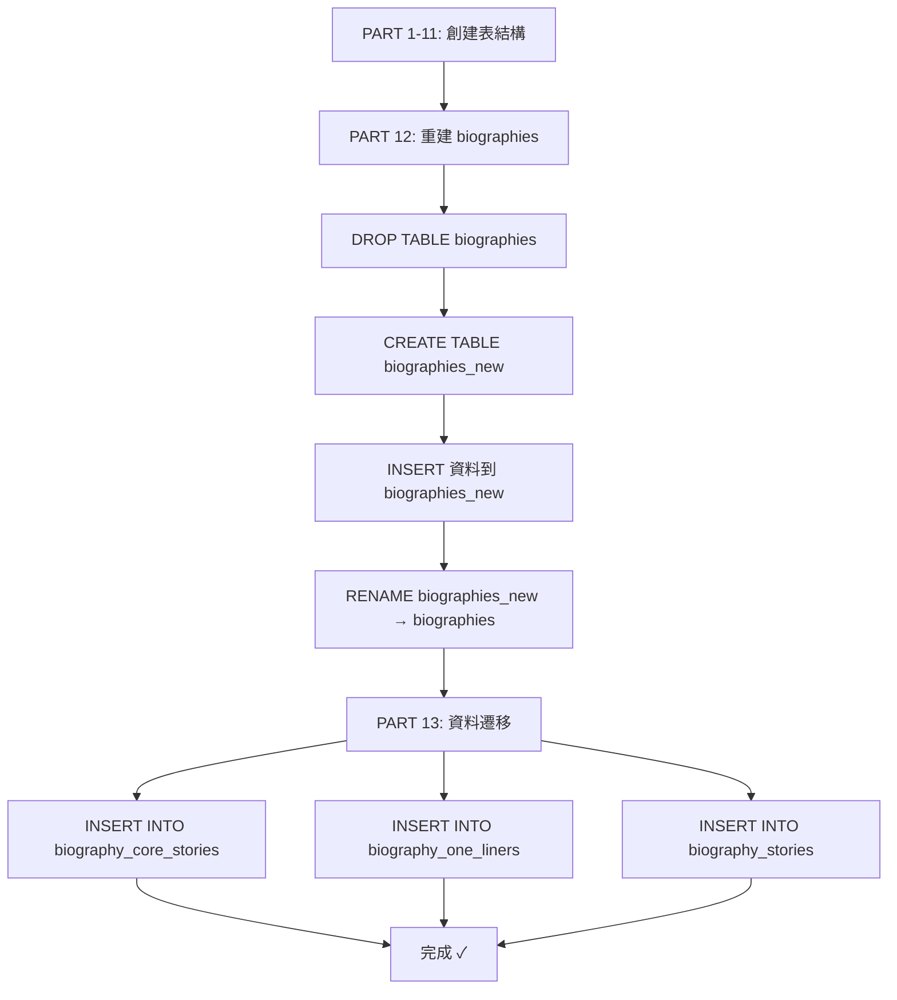

# 遷移腳本 v2 版本變更說明

## 檔案名稱

`migrations/0027_consolidated_schema_updates_FIXED_v2.sql`

## 核心變更

### 問題回顧

**原版本 (FIXED v1)** 的執行順序:

```
PART 1-11: 創建表結構、種子資料
PART 12: 資料遷移 (JSON → 關聯式表格) ← 插入資料
PART 13: 重建 biographies 表 ← DROP TABLE 觸發 CASCADE DELETE
```

**問題**: PART 13 的 `DROP TABLE biographies` 觸發外鍵約束的 `ON DELETE CASCADE`,導致 PART 12 剛插入的所有資料被刪除。

### 解決方案

**v2 版本** 調整執行順序:

```
PART 1-11: 創建表結構、種子資料
PART 12: 重建 biographies 表 (保留 JSON 欄位) ← 先重建
PART 13: 資料遷移 (JSON → 關聯式表格) ← 後遷移
```

這樣,當 PART 13 執行資料遷移時:

- `biographies` 表已經是新的表結構
- 不會再有 DROP TABLE 操作
- 外鍵約束正常運作,資料安全插入

## 具體修改

### 1. 頭部註釋更新

```sql
-- Migration: Consolidated Schema Updates (0027-0032) - FIXED VERSION v2
-- Description:
--   修復版本 v2 - 調整執行順序解決外鍵約束問題:
--   1. 先重建 biographies 表 (保留 JSON 欄位)
--   2. 再執行資料遷移 (從 JSON 到關聯式表格)
--   3. 這樣避免了 DROP TABLE 觸發 ON DELETE CASCADE 刪除已遷移的資料
```

### 2. PART 順序對調

| 原 PART | 新 PART | 內容                         |
| ------- | ------- | ---------------------------- |
| PART 12 | PART 13 | 資料遷移 (JSON → 關聯式表格) |
| PART 13 | PART 12 | 重建 biographies 表          |

### 3. PART 12 註釋更新

```sql
-- ============================================
-- PART 12: Cleanup redundant biography columns
-- 🔧 執行順序調整: 先重建表,再遷移資料
-- Using table rebuild for SQLite/D1 compatibility
-- ============================================
```

### 4. PART 13 註釋更新

```sql
-- ============================================
-- PART 13: Migrate JSON data to new tables
-- 🔧 執行順序調整: 在 biographies 表重建後執行,避免外鍵級聯刪除
-- ============================================
```

## 執行順序詳解

### 新的執行流程



### 關鍵時間點

1. **T1**: PART 5 創建 `biography_core_stories` 等表 (空的,有外鍵約束)
2. **T2**: PART 12 重建 `biographies` 表
   - 此時 `biography_core_stories` 仍是空的
   - DROP TABLE 不會觸發 CASCADE DELETE (因為子表是空的)
3. **T3**: PART 13 執行資料遷移
   - 此時 `biographies` 表已經是新結構
   - INSERT 正常執行,外鍵約束正常運作

## 測試計劃

### 在全新環境測試

如果您有一個測試環境可以完全重置:

```bash
# 重置 preview 資料庫 (警告: 會刪除所有資料)
# 然後執行 v2 遷移
pnpm wrangler d1 execute nobodyclimb-db-preview --remote \
  --file=migrations/0027_consolidated_schema_updates_FIXED_v2.sql
```

### 在現有 Preview 環境測試

如果 Preview 環境已經執行過部分遷移:

```bash
# 方案 1: 先清空相關表
pnpm wrangler d1 execute nobodyclimb-db-preview --remote --command "
DELETE FROM biography_core_stories;
DELETE FROM biography_one_liners;
DELETE FROM biography_stories;
"

# 然後執行 v2 的 PART 13 (資料遷移)
pnpm wrangler d1 execute nobodyclimb-db-preview --remote \
  --file=execute-data-migration.sql
```

## 驗證步驟

### 1. 執行遷移

```bash
cd backend
pnpm wrangler d1 execute nobodyclimb-db-preview --remote \
  --file=migrations/0027_consolidated_schema_updates_FIXED_v2.sql
```

### 2. 驗證結果

```bash
# 快速驗證
pnpm wrangler d1 execute nobodyclimb-db-preview --remote --command "
SELECT 'Core Stories' as table_name, COUNT(*) as count FROM biography_core_stories
UNION ALL
SELECT 'One Liners', COUNT(*) FROM biography_one_liners
UNION ALL
SELECT 'Stories', COUNT(*) FROM biography_stories;
"
```

預期結果:

```
Core Stories: 49 筆
One Liners: 41 筆
Stories: 61 筆
```

### 3. 完整驗證

```bash
./verify-migration-step-by-step.sh preview
```

## Production 部署建議

### 方案 1: 直接使用 v2 (推薦,如果 Production 尚未執行遷移)

```bash
# 1. 備份 (重要!)
pnpm wrangler d1 export nobodyclimb-db --remote --output=prod-backup-before-v2.sql

# 2. 執行 v2 遷移
pnpm wrangler d1 execute nobodyclimb-db --remote \
  --file=migrations/0027_consolidated_schema_updates_FIXED_v2.sql

# 3. 驗證
pnpm wrangler d1 execute nobodyclimb-db --remote --command "
SELECT 'Core Stories' as t, COUNT(*) as c FROM biography_core_stories
UNION ALL SELECT 'One Liners', COUNT(*) FROM biography_one_liners
UNION ALL SELECT 'Stories', COUNT(*) FROM biography_stories;
"
```

### 方案 2: 兩階段執行 (如果 Production 已執行過結構遷移)

```bash
# 1. 備份
pnpm wrangler d1 export nobodyclimb-db --remote --output=prod-backup.sql

# 2. 如果已執行過 FIXED v1,只執行資料遷移
pnpm wrangler d1 execute nobodyclimb-db --remote \
  --file=execute-data-migration.sql

# 3. 驗證
(同上)
```

## 檔案清單

| 檔案                                                       | 用途                 | 狀態            |
| ---------------------------------------------------------- | -------------------- | --------------- |
| `migrations/0027_consolidated_schema_updates_FIXED.sql`    | v1 版本 (有外鍵問題) | ⚠️ 不推薦使用   |
| `migrations/0027_consolidated_schema_updates_FIXED_v2.sql` | v2 版本 (順序修正)   | ✅ **推薦使用** |
| `execute-data-migration.sql`                               | 獨立資料遷移腳本     | ✅ 補救方案     |
| `verify-migration-step-by-step.sh`                         | 驗證腳本             | ✅ 驗證工具     |

## 總結

✅ **v2 版本的優勢**:

1. 一次執行完成,不需要分兩個腳本
2. 邏輯順序正確:先準備表結構,再遷移資料
3. 避免外鍵約束問題
4. 更符合標準的資料庫遷移最佳實踐

🎯 **建議**:

- 新環境直接使用 v2
- 已執行 v1 的環境使用 `execute-data-migration.sql` 補救
- 保留 JSON 欄位作為備份,日後可選擇性清理
