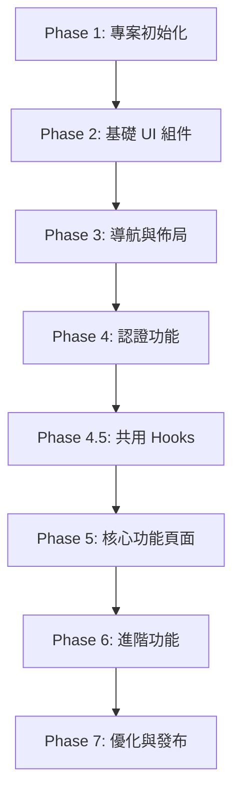

# NobodyClimb App 開發任務清單

> 狀態：規劃中
> 更新日期：2026-02-01
> 參考文件：[設計系統](/docs/app-ui/design-system-reference.md)、[Monorepo 結構](/docs/techstack/monorepo.md)、[App 技術棧](/docs/techstack/app.md)

---

## 專案概覽

| 項目 | 技術 |
|------|------|
| 框架 | React Native 0.81.x + Expo SDK 54 |
| 路由 | Expo Router 4.x |
| UI | Tamagui 1.x |
| 狀態管理 | Zustand 4.5.x + TanStack Query 5.x |
| 動畫 | React Native Reanimated 3.x |
| 認證 | expo-secure-store + OAuth |
| 圖標 | @expo/vector-icons (Lucide) |

---

## Phase 1: 專案初始化與基礎建設

### 1.1 建立 Expo 專案

- [ ] **1.1.1** 建立目錄並初始化專案
  ```bash
  mkdir -p apps
  cd apps
  npx create-expo-app@latest app --template blank-typescript
  ```

- [ ] **1.1.2** 設定 Expo Router
  - 安裝 expo-router 依賴
  - 建立 `apps/app/app/` 目錄結構 (檔案路由)
  - 設定 `_layout.tsx` Root Layout

- [ ] **1.1.3** 設定 Metro (Monorepo 支援)
  - 建立 `apps/app/metro.config.js`
  - 設定 `watchFolders` 監控 monorepo 套件
  - 設定 `nodeModulesPaths` 解析路徑

- [ ] **1.1.4** 設定 Deep Linking
  - 在 `app.json` 設定 `scheme: "nobodyclimb"`
  - 安裝 `expo-linking`
  - 設定 universal links 配置

### 1.2 設定 Tamagui

- [ ] **1.2.1** 安裝 Tamagui 核心套件
  ```bash
  cd apps/app
  pnpm add tamagui @tamagui/core @tamagui/config @tamagui/shorthands
  ```

- [ ] **1.2.2** 安裝 Tamagui Babel 插件
  ```bash
  pnpm add -D @tamagui/babel-plugin
  ```

- [ ] **1.2.3** 設定 `apps/app/babel.config.js`
  - 加入 `@tamagui/babel-plugin`
  - 加入 `react-native-reanimated/plugin`
  - 設定 `disableExtraction` 開發模式

- [ ] **1.2.4** 建立 `apps/app/tamagui.config.ts`
  - 從 `@nobodyclimb/constants` 導入設計 tokens (COLORS, SPACING, etc.)
  - 設定 light/dark 主題
  - 設定 Button/Card sub-themes
  - 導出 TypeScript 型別

### 1.3 整合共用套件

- [ ] **1.3.1** 設定 workspace 依賴
  ```bash
  cd apps/app
  pnpm add @nobodyclimb/types @nobodyclimb/schemas @nobodyclimb/constants @nobodyclimb/utils @nobodyclimb/hooks @nobodyclimb/api-client --workspace
  ```

- [ ] **1.3.2** 設定 API Client 初始化
  - 建立 `apps/app/src/lib/api.ts`
  - 使用 `createNativeApiClient` 建立實例
  - 整合 `expo-secure-store` 儲存 token

- [ ] **1.3.3** 設定 QueryClientProvider
  - 安裝 `@tanstack/react-query`
  - 建立 QueryClient 實例
  - 設定預設 staleTime、retry 策略

- [ ] **1.3.4** 設定 SafeAreaProvider
  - 安裝 `react-native-safe-area-context`
  - 在 Root Layout 加入 Provider

- [ ] **1.3.5** 建立 `apps/app/src/providers/index.tsx`
  - 整合所有 Providers (順序由外到內)：
    - SafeAreaProvider
    - QueryClientProvider
    - TamaguiProvider
  - 支援深色模式 (`useColorScheme`)

### 1.4 設定動畫系統

- [ ] **1.4.1** 安裝動畫依賴
  ```bash
  pnpm add react-native-reanimated react-native-gesture-handler
  ```

- [ ] **1.4.2** 建立 `apps/app/src/theme/animations.ts`
  - 從 `@nobodyclimb/constants` 導入 `DURATION` (不要重複定義)
  - 定義 easing 曲線 (使用 Reanimated Easing)
  - 定義常用動畫配置 (fadeIn, slideUp, pressScale)

### 1.5 設定圖標系統

- [ ] **1.5.1** 安裝圖標庫
  ```bash
  pnpm add @expo/vector-icons lucide-react-native
  ```

- [ ] **1.5.2** 建立 `apps/app/src/components/ui/Icon.tsx`
  - 封裝 Lucide 圖標
  - 支援設計系統尺寸 (xs: 16, sm: 20, md: 24, lg: 32, xl: 48)
  - 預設顏色使用 `SEMANTIC_COLORS.textSubtle`

---

## Phase 2: 基礎 UI 組件

### 2.1 文字與排版

- [ ] **2.1.1** 建立 `Text` 組件
  - 變體：h1, h2, h3, h4, body, bodyBold, caption, small
  - 支援 color prop (textMain, textSubtle, textMuted)
  - 使用 Noto Sans TC 字體

- [ ] **2.1.2** 設定自定義字體
  - 安裝 `expo-font`
  - 載入 Noto Sans TC, Glow Sans TC
  - 設定 Tamagui fonts 配置

### 2.2 按鈕組件

- [ ] **2.2.1** 建立 `Button` 組件
  - 變體：primary, secondary, outline, ghost, destructive
  - 尺寸：sm (32px), md (40px), lg (48px)
  - 狀態：hover, pressed, disabled, loading
  - 使用 Pressable + Reanimated 實作按壓動畫

- [ ] **2.2.2** 建立 `IconButton` 組件
  - 圓形按鈕變體
  - 支援圖標 + Badge

### 2.3 表單組件

- [ ] **2.3.1** 建立 `Input` 組件
  - 狀態：default, focused, error, disabled
  - 高度 48px, 圓角 8px
  - Focus 邊框使用品牌黃色 (#FFE70C)
  - Error 邊框使用品牌紅色 (#DA3737)

- [ ] **2.3.2** 建立 `FormField` 組件
  - 整合 Label + Input + Error Message
  - 支援 React Hook Form

- [ ] **2.3.3** 建立 `TextArea` 組件
  - 多行輸入
  - 自動高度調整

### 2.4 卡片組件

- [ ] **2.4.1** 建立 `Card` 組件
  - 背景色 #FFFFFF
  - 圓角 12px, 邊框 1px #EBEAEA
  - 陰影 sm

- [ ] **2.4.2** 建立 `CardMedia` 子組件
  - 圖片區域，圓角繼承

- [ ] **2.4.3** 建立 `CardContent` 子組件
  - 內容區域 padding 16px

- [ ] **2.4.4** 建立 `CardTitle` / `CardInfo` 子組件

### 2.5 頭像組件

- [ ] **2.5.1** 建立 `Avatar` 組件
  - 尺寸：xs (24), sm (32), md (40), lg (56), xl (80)
  - 圓形 (borderRadius: full)
  - Fallback 顯示 (預設背景 #EBEAEA)

- [ ] **2.5.2** 支援圖片載入
  - 使用 `expo-image`
  - 載入中顯示 placeholder

### 2.6 其他基礎組件

- [ ] **2.6.1** 建立 `Badge` 組件
  - 標籤/徽章樣式
  - 變體：default, success, warning, error

- [ ] **2.6.2** 建立 `Divider` 組件
  - 水平/垂直分隔線
  - 顏色使用 `SEMANTIC_COLORS.border` (#EBEAEA)

- [ ] **2.6.3** 建立 `Spinner` 組件
  - 載入指示器
  - 品牌黃色 `BRAND_YELLOW[100]` (#FFE70C)

- [ ] **2.6.4** 建立 `EmptyState` 組件
  - 空狀態顯示
  - 支援圖標 + 標題 + 描述 + 操作按鈕

- [ ] **2.6.5** 建立 `ListItem` 組件
  - 左圖標 + 標題 + 描述 + 右箭頭/內容
  - 支援 onPress 點擊
  - 支援 chevron (箭頭) 顯示
  - 支援分隔線選項

---

## Phase 3: 導航與佈局

### 3.1 Tab Bar

- [ ] **3.1.1** 建立 Tab Navigator 配置
  - 路徑：`apps/app/app/(tabs)/_layout.tsx`
  - 設定 Tab Bar 樣式 (高度 56px, 白色背景)

- [ ] **3.1.2** 設定 Tab Items
  - 首頁、探索、傳記、個人
  - 圖標尺寸 24px (使用 Icon 組件 size="md")
  - 未選中 `SEMANTIC_COLORS.textMuted` (#8E8C8C)
  - 選中 `SEMANTIC_COLORS.textMain` (#1B1A1A)
  - 標籤字體 `FONT_SIZE.xs` (12px)

- [ ] **3.1.3** 處理 Safe Area
  - 使用 `useSafeAreaInsets` 取得 bottom inset
  - Tab Bar paddingBottom 配合 Home Indicator

### 3.2 頁面佈局

- [ ] **3.2.1** 建立 `ScreenLayout` 組件
  - 處理 Safe Area Insets
  - 支援 header + content + footer

- [ ] **3.2.2** 建立 `ScrollLayout` 組件
  - 可滾動頁面容器
  - 支援 Pull-to-Refresh

- [ ] **3.2.3** 建立 `Header` 組件
  - 返回按鈕、標題、操作按鈕

### 3.3 彈出層組件

- [ ] **3.3.1** 建立 `BottomSheet` 組件
  - 使用 `@gorhom/bottom-sheet`
  - 支援多個 snap points
  - 背景遮罩

- [ ] **3.3.2** 建立 `Dialog` 組件
  - 居中彈窗
  - 標題 + 內容 + 操作按鈕

- [ ] **3.3.3** 建立 `Toast` 組件
  - 輕量提示
  - 變體：success, error, info, warning
  - 自動消失

---

## Phase 4: 認證功能

### 4.1 認證頁面

- [ ] **4.1.1** 建立登入頁面 (`apps/app/app/auth/login.tsx`)
  - Email + Password 表單
  - 使用 React Hook Form + Zod 驗證 (從 `@nobodyclimb/schemas` 導入)
  - Google OAuth 按鈕
  - 連結到註冊頁面

- [ ] **4.1.2** 建立註冊頁面 (`apps/app/app/auth/register.tsx`)
  - 姓名 + Email + 密碼 + 確認密碼
  - 使用 `registerSchema` from `@nobodyclimb/schemas`
  - 連結到登入頁面

- [ ] **4.1.3** 建立忘記密碼頁面 (`apps/app/app/auth/forgot-password.tsx`)

### 4.2 認證邏輯

- [ ] **4.2.1** 設定 Auth Store
  - 使用 `createAuthStore` from `@nobodyclimb/hooks`
  - 整合 `expo-secure-store`

- [ ] **4.2.2** 建立 `useAuth` hook
  - login, logout, register 方法
  - 當前使用者狀態
  - 載入狀態

- [ ] **4.2.3** 建立認證 Guard
  - 檢查登入狀態
  - 未登入導向登入頁面
  - 使用 Expo Router 的 layout

### 4.3 Google OAuth

- [ ] **4.3.1** 設定 `expo-auth-session`
  - Google OAuth 配置
  - 處理 redirect

- [ ] **4.3.2** 整合後端 OAuth 驗證
  - 發送 ID token 到後端
  - 取得 JWT token

---

## Phase 4.5: 共用 Hooks 擴充

> 在開發核心功能前，需先擴充 `@nobodyclimb/hooks` 套件

### 4.5.1 擴充共用 Hooks

- [ ] **4.5.1.1** 建立 `useBiography` hook (`packages/hooks/src/useBiography.ts`)
  - 使用 TanStack Query 獲取傳記列表
  - 支援分頁、篩選
  - 導出 `useBiographyList`, `useBiographyDetail`

- [ ] **4.5.1.2** 建立 `useProfile` hook (`packages/hooks/src/useProfile.ts`)
  - 獲取使用者個人資料
  - 更新個人資料

- [ ] **4.5.1.3** 更新 `packages/hooks/src/index.ts`
  - 導出新建立的 hooks

---

## Phase 5: 核心功能頁面

### 5.1 首頁

- [ ] **5.1.1** 建立首頁 (`apps/app/app/(tabs)/index.tsx`)
  - Hero 區塊
  - 精選傳記區塊
  - 最新內容區塊

- [ ] **5.1.2** 建立 `FeaturedBiographyCard` 組件
  - 頭像 + 姓名 + 簡介
  - 點擊進入詳情

### 5.2 傳記列表

- [ ] **5.2.1** 建立傳記列表頁 (`apps/app/app/(tabs)/biography.tsx`)
  - 使用 `useBiographyList` hook from `@nobodyclimb/hooks`
  - FlatList 虛擬滾動
  - Pull-to-Refresh

- [ ] **5.2.2** 建立 `BiographyCard` 組件
  - 頭像、姓名、標籤
  - 進入動畫 (使用 FadeIn)

- [ ] **5.2.3** 實作無限滾動
  - 使用 `useInfiniteScroll` from `@nobodyclimb/hooks`
  - 載入更多指示器 (使用 Spinner 組件)

### 5.3 傳記詳情

- [ ] **5.3.1** 建立傳記詳情頁 (`apps/app/app/biography/[id].tsx`)
  - 使用 `useBiographyDetail` hook
  - Hero 區塊 (頭像、姓名、標籤)
  - 故事區塊
  - 足跡區塊

- [ ] **5.3.2** 建立 `BiographyHero` 組件
  - 大頭像 (Avatar size="xl")
  - 社群連結
  - 編輯按鈕 (自己的傳記)

- [ ] **5.3.3** 建立 `StoryCard` 組件
  - 故事標題 + 內容
  - 按讚/留言功能

### 5.4 個人頁面

- [ ] **5.4.1** 建立個人頁面 (`apps/app/app/(tabs)/profile.tsx`)
  - 使用 `useProfile` hook from `@nobodyclimb/hooks`
  - 使用者資訊
  - 統計數據
  - 設定入口

- [ ] **5.4.2** 建立設定頁面 (`apps/app/app/profile/settings.tsx`)
  - 使用 ListItem 組件建立設定列表
  - 通知設定
  - 帳號設定
  - 登出

---

## Phase 6: 進階功能

### 6.1 動畫元件

- [ ] **6.1.1** 建立 `FadeIn` 動畫包裝
  - 使用 Reanimated 實作
  - 支援 delay

- [ ] **6.1.2** 建立 `SlideUp` 動畫包裝
  - 從下方滑入
  - 支援 stagger 效果

- [ ] **6.1.3** 建立 `ScaleIn` 動畫包裝
  - 縮放進入效果

- [ ] **6.1.4** 建立 `AnimatedList` 組件
  - FlatList 子項目進入動畫

### 6.2 互動功能

- [ ] **6.2.1** 建立按讚功能
  - 樂觀更新
  - 按讚動畫

- [ ] **6.2.2** 建立留言功能
  - 留言列表
  - 新增留言
  - 回覆留言

- [ ] **6.2.3** 建立分享功能
  - 使用 `expo-sharing`
  - Deep Link 產生

### 6.3 推播通知

- [ ] **6.3.1** 設定 `expo-notifications`
  - 權限請求
  - Push Token 取得

- [ ] **6.3.2** 整合後端推播
  - 註冊 Push Token
  - 處理通知點擊

- [ ] **6.3.3** 建立通知中心頁面
  - 通知列表
  - 已讀/未讀狀態

---

## Phase 7: 優化與發布準備

### 7.1 效能優化

- [ ] **7.1.1** 圖片最佳化
  - 使用 `expo-image` 快取
  - 適當的圖片尺寸

- [ ] **7.1.2** 列表效能
  - FlatList 優化 (initialNumToRender, maxToRenderPerBatch)
  - 使用 `React.memo` 避免重複渲染

- [ ] **7.1.3** Bundle Size 監控
  - 分析 bundle 大小
  - Tree shaking 確認

### 7.2 離線支援

- [ ] **7.2.1** 設定 TanStack Query 持久化
  - 使用 AsyncStorage
  - 快取策略

- [ ] **7.2.2** 網路狀態處理
  - 使用 `@react-native-community/netinfo`
  - 離線提示

### 7.3 錯誤處理

- [ ] **7.3.1** 建立 `ErrorBoundary` 組件
  - 錯誤 UI 顯示
  - 重試按鈕

- [ ] **7.3.2** 整合 Sentry
  - 安裝 `@sentry/react-native`
  - 錯誤追蹤配置

### 7.4 發布準備

- [ ] **7.4.1** 設定 EAS Build
  - 建立 `eas.json`
  - Development / Preview / Production profiles

- [ ] **7.4.2** App Store 準備
  - App Icon (1024x1024)
  - Splash Screen
  - App Store 截圖

- [ ] **7.4.3** Google Play 準備
  - Feature Graphic
  - Screenshots
  - Privacy Policy

---

## 進度追蹤

| Phase | 描述 | 任務數 | 狀態 | 完成率 |
|-------|------|--------|------|--------|
| Phase 1 | 專案初始化與基礎建設 | 17 | 未開始 | 0% |
| Phase 2 | 基礎 UI 組件 | 18 | 未開始 | 0% |
| Phase 3 | 導航與佈局 | 10 | 未開始 | 0% |
| Phase 4 | 認證功能 | 8 | 未開始 | 0% |
| Phase 4.5 | 共用 Hooks 擴充 | 3 | 未開始 | 0% |
| Phase 5 | 核心功能頁面 | 10 | 未開始 | 0% |
| Phase 6 | 進階功能 | 10 | 未開始 | 0% |
| Phase 7 | 優化與發布準備 | 10 | 未開始 | 0% |

**總計：86 項任務**

---

## 依賴關係



---

## 技術決策記錄

| 決策 | 選擇 | 原因 |
|------|------|------|
| UI 框架 | Tamagui | 編譯時優化、效能優異、完整主題系統 |
| 路由 | Expo Router | 基於檔案路由、與 Next.js 類似、Deep Linking 支援 |
| 動畫 | Reanimated 3 | 效能優異、Tamagui 原生支援 |
| 狀態管理 | Zustand + TanStack Query | 與 Web 共用、輕量高效 |
| Token 儲存 | expo-secure-store | 安全儲存、加密 |
| 圖標庫 | Lucide (via @expo/vector-icons) | 與 Web 一致、輕量、可自訂 |
| 設計 Tokens | @nobodyclimb/constants | 共用套件、單一來源 |

---

## 注意事項

1. **路徑規範**：App 專案位於 `apps/app/`，所有路徑以此為基準
2. **共用套件優先**：優先使用 `@nobodyclimb/*` 套件，避免重複定義
3. **設計系統一致性**：顏色、間距等使用 `@nobodyclimb/constants` 導出的常數
4. **TypeScript 嚴格模式**：確保所有組件都有完整型別定義

---

## 參考資源

- [設計系統參考](/docs/app-ui/design-system-reference.md)
- [Monorepo 結構](/docs/techstack/monorepo.md)
- [App 技術棧](/docs/techstack/app.md)
- [Expo Router 文件](https://docs.expo.dev/router/introduction/)
- [Tamagui 文件](https://tamagui.dev/docs/intro/introduction)
- [Lucide Icons](https://lucide.dev/icons/)
