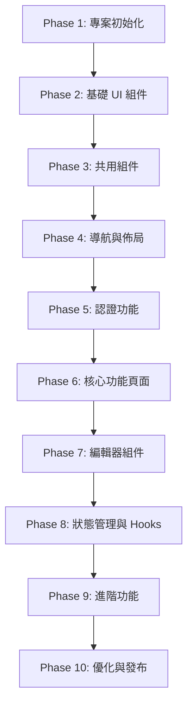

# NobodyClimb App 開發任務清單

> 狀態：進行中
> 更新日期：2026-02-02
> 最後同步：2026-02-02 (與 apps/web 組件結構完整核對)
> 參考文件：[設計系統](/docs/app-ui/design-system-reference.md)、[Monorepo 結構](/docs/techstack/monorepo.md)、[App 技術棧](/docs/techstack/app.md)
> UI 參考：`apps/web` (確保 App UI 與 Web 完全一致)

---

## 專案概覽

| 項目 | 技術 |
|------|------|
| 框架 | React Native 0.81.x + Expo SDK 54 |
| 路由 | Expo Router 4.x |
| UI | Tamagui 1.x |
| 狀態管理 | Zustand 4.5.x + TanStack Query 5.x |
| 動畫 | React Native Reanimated 3.x |
| 認證 | expo-secure-store + OAuth |
| 圖標 | @expo/vector-icons (Lucide) |

---

## Phase 1: 專案初始化與基礎建設

### 1.1 建立 Expo 專案

- [x] **1.1.1** 建立目錄並初始化專案
  ```bash
  mkdir -p apps
  cd apps
  npx create-expo-app@latest mobile --template blank-typescript
  ```

- [x] **1.1.2** 設定 Expo Router
  - 安裝 expo-router 依賴
  - 建立 `apps/mobile/app/` 目錄結構 (檔案路由)
  - 設定 `_layout.tsx` Root Layout

- [x] **1.1.3** 設定 Metro (Monorepo 支援)
  - 建立 `apps/mobile/metro.config.js`
  - 設定 `watchFolders` 監控 monorepo 套件
  - 設定 `nodeModulesPaths` 解析路徑

- [x] **1.1.4** 設定 Deep Linking
  - 在 `app.json` 設定 `scheme: "nobodyclimb"`
  - 安裝 `expo-linking`
  - 設定 universal links 配置

### 1.2 設定 Tamagui

- [x] **1.2.1** 安裝 Tamagui 核心套件
  ```bash
  cd apps/mobile
  pnpm add tamagui @tamagui/core @tamagui/config @tamagui/shorthands
  ```

- [x] **1.2.2** 安裝 Tamagui Babel 插件
  ```bash
  pnpm add -D @tamagui/babel-plugin
  ```

- [x] **1.2.3** 設定 `apps/mobile/babel.config.js`
  - 加入 `@tamagui/babel-plugin`
  - 加入 `react-native-reanimated/plugin`
  - 設定 `disableExtraction` 開發模式

- [x] **1.2.4** 建立 `apps/mobile/tamagui.config.ts`
  - 從 `@nobodyclimb/constants` 導入設計 tokens (COLORS, SPACING, etc.)
  - 設定 light/dark 主題
  - 設定 Button/Card sub-themes
  - 導出 TypeScript 型別

### 1.3 整合共用套件

- [x] **1.3.1** 設定 workspace 依賴
  ```bash
  cd apps/mobile
  pnpm add @nobodyclimb/types @nobodyclimb/schemas @nobodyclimb/constants @nobodyclimb/utils @nobodyclimb/hooks @nobodyclimb/api-client --workspace
  ```

- [x] **1.3.2** 設定 API Client 初始化
  - 建立 `apps/mobile/src/lib/api.ts`
  - 使用 `createNativeApiClient` 建立實例
  - 整合 `expo-secure-store` 儲存 token

- [x] **1.3.3** 設定 QueryClientProvider
  - 安裝 `@tanstack/react-query`
  - 建立 QueryClient 實例
  - 設定預設 staleTime、retry 策略

- [x] **1.3.4** 設定 SafeAreaProvider
  - 安裝 `react-native-safe-area-context`
  - 在 Root Layout 加入 Provider

- [x] **1.3.5** 建立 `apps/mobile/src/providers/index.tsx`
  - 整合所有 Providers (順序由外到內)：
    - SafeAreaProvider
    - QueryClientProvider
    - TamaguiProvider
  - 支援深色模式 (`useColorScheme`)

### 1.4 設定動畫系統

- [x] **1.4.1** 安裝動畫依賴
  ```bash
  pnpm add react-native-reanimated react-native-gesture-handler
  ```

- [x] **1.4.2** 建立 `apps/mobile/src/theme/animations.ts`
  - 從 `@nobodyclimb/constants` 導入 `DURATION` (不要重複定義)
  - 定義 easing 曲線 (使用 Reanimated Easing)
  - 定義常用動畫配置 (fadeIn, slideUp, pressScale)

### 1.5 設定圖標系統

- [x] **1.5.1** 安裝圖標庫
  ```bash
  pnpm add @expo/vector-icons lucide-react-native
  ```

- [x] **1.5.2** 建立 `apps/mobile/src/components/ui/Icon.tsx`
  - 封裝 Lucide 圖標 (與 Web 使用相同圖標)
  - 支援設計系統尺寸 (xs: 16, sm: 20, md: 24, lg: 32, xl: 48)
  - 預設顏色使用 `SEMANTIC_COLORS.textSubtle`

---

## Phase 2: 基礎 UI 組件 (與 Web 一致)

> **重要**：所有 UI 組件需與 `apps/web/src/components/ui/` 保持一致的 API 和視覺效果

### 2.1 文字與排版

- [x] **2.1.1** 建立 `Text` 組件
  - 變體：h1, h2, h3, h4, body, bodyBold, caption, small
  - 支援 color prop (textMain: #1B1A1A, textSubtle: #535353, textMuted: #8E8C8C)
  - 使用 Noto Sans TC 字體

- [x] **2.1.2** 設定自定義字體
  - 安裝 `expo-font`
  - 載入 Noto Sans TC, Glow Sans TC
  - 設定 Tamagui fonts 配置

### 2.2 按鈕組件 (對應 `apps/web/src/components/ui/button.tsx`)

- [x] **2.2.1** 建立 `Button` 組件
  - **變體** (與 Web 一致)：
    - `primary`: bg-[#1B1A1A] text-white hover:bg-[#292827]
    - `secondary`: border border-[#1B1A1A] bg-transparent hover:bg-[#f0f0f0]
    - `destructive`: bg-destructive text-destructive-foreground
    - `outline`: border border-input bg-background
    - `ghost`: hover:bg-accent
    - `link`: text-primary underline-offset-4
  - **尺寸** (與 Web 一致)：
    - `default`: h-10 px-4 py-2
    - `sm`: h-9 px-3
    - `md`: h-10 px-6 py-2
    - `lg`: h-12 px-8 py-3
    - `icon`: h-10 w-10
  - **功能**：
    - 支援 `icon` prop 顯示圖標
    - 支援 `hasIcon` variant 自動加入 gap-2
    - 支援 `asChild` 渲染為其他元素
  - 使用 Pressable + Reanimated 實作按壓動畫

- [x] **2.2.2** 建立 `IconButton` 組件
  - 基於 Button 的 icon size variant
  - 圓形按鈕變體

### 2.3 表單組件 (對應 `apps/web/src/components/ui/input.tsx`)

- [x] **2.3.1** 建立 `Input` 組件
  - **狀態** (與 Web 一致)：
    - `default`: bg-white border-transparent
    - `hover`: bg-[#F0F0F0] border-transparent
    - `focus`: bg-[#F0F0F0] border-[#ffe70c]
    - `disabled`: bg-[#F0F0F0] border-[#D3D3D3] opacity-50
    - `error`: bg-[#FEE] border-[#ff4d4f]
  - **Variant**：
    - `default`: border-transparent
    - `outline`: border-[#D3D3D3]
  - **功能**：
    - 支援 `leftIcon`, `rightIcon` props
    - 支援 `textStatus`: placeholder (#9D9D9D) / filled (#1B1A1A)
    - 支援 `wrapperClassName` 外層樣式
  - 圓角 rounded-lg

- [x] **2.3.2** 建立 `Label` 組件 (對應 `apps/web/src/components/ui/label.tsx`)
  - 表單標籤樣式

- [x] **2.3.3** 建立 `TextArea` 組件 (對應 `apps/web/src/components/ui/textarea.tsx`)
  - 多行輸入
  - 自動高度調整
  - 相同的狀態樣式

- [x] **2.3.4** 建立 `Select` 組件 (對應 `apps/web/src/components/ui/select.tsx`)
  - 下拉選擇器
  - 使用 BottomSheet 顯示選項 (Native)

- [x] **2.3.5** 建立 `Switch` 組件 (對應 `apps/web/src/components/ui/switch.tsx`)
  - 開關切換
  - 動畫效果

- [x] **2.3.6** 建立 `TagInput` 組件 (對應 `apps/web/src/components/ui/tag-input.tsx`)
  - 多標籤輸入
  - 支援新增/刪除標籤

- [x] **2.3.7** 建立 `SearchInput` 組件 (對應 `apps/web/src/components/ui/search-input.tsx`)
  - 搜尋輸入框
  - 搜尋圖標
  - 清除按鈕

### 2.4 卡片組件 (對應 `apps/web/src/components/ui/card.tsx`)

- [x] **2.4.1** 建立 `Card` 組件
  - **Props** (與 Web 一致)：
    - `type`: 'normal' | 'homepage'
    - `state`: 'normal' | 'hover'
    - `device`: 'desktop' | 'mobile'
  - 樣式：overflow-hidden rounded-lg bg-white shadow-sm
  - homepage 類型：cursor-pointer
  - hover 狀態：shadow-md

- [x] **2.4.2** 建立 `CardMedia` 子組件
  - 圖片區域，relative overflow-hidden

- [x] **2.4.3** 建立 `CardInfo` 子組件
  - 內容區域 p-4 md:p-5
  - 支援 type 和 device props

- [x] **2.4.4** 建立 `CardTitle` 子組件
  - **Props**：title, subtitle, experience, showArrow
  - 標題：text-2xl font-medium text-[#1B1A1A]
  - 經歷：攀岩資歷顯示，帶黃色分隔線 (#FAF40A)
  - 箭頭：ArrowRightCircle 圖標

- [x] **2.4.5** 建立 `CardContent` 子組件
  - 支援 `as` prop 渲染為不同元素
  - 樣式：text-sm text-[#1B1A1A]

### 2.5 頭像組件 (對應 `apps/web/src/components/ui/avatar-with-fallback.tsx`)

- [x] **2.5.1** 建立 `AvatarWithFallback` 組件
  - 尺寸：xs (24), sm (32), md (40), lg (56), xl (80)
  - 圓形 (borderRadius: full)
  - Fallback 顯示 (預設背景 #EBEAEA)

- [x] **2.5.2** 支援圖片載入
  - 使用 `expo-image`
  - 載入中顯示 placeholder

### 2.6 其他基礎組件

- [x] **2.6.1** 建立 `LoadingSpinner` 組件 (對應 `apps/web/src/components/ui/loading-spinner.tsx`)
  - 載入指示器
  - 品牌黃色 (#FFE70C)

- [x] **2.6.2** 建立 `EmptyState` 組件 (對應 `apps/web/src/components/ui/empty-state.tsx`)
  - 空狀態顯示
  - 支援圖標 + 標題 + 描述 + 操作按鈕

- [x] **2.6.3** 建立 `Tabs` 組件 (對應 `apps/web/src/components/ui/tabs.tsx`)
  - TabsList, TabsTrigger, TabsContent
  - 相同的樣式和動畫

- [x] **2.6.4** 建立 `Toast` 組件 (對應 `apps/web/src/components/ui/toast.tsx`)
  - 輕量提示
  - 變體：success, error, info, warning
  - 自動消失

- [x] **2.6.4.1** 建立 `Toaster` 組件 (對應 `apps/web/src/components/ui/toaster.tsx`)
  - Toast 容器組件
  - 管理 Toast 顯示位置和堆疊

- [x] **2.6.5** 建立 `Sheet` 組件 (對應 `apps/web/src/components/ui/sheet.tsx`)
  - 底部彈出面板
  - 使用 `@gorhom/bottom-sheet`

- [x] **2.6.6** 建立 `ConfirmDialog` 組件 (對應 `apps/web/src/components/ui/confirm-dialog.tsx`)
  - 確認對話框
  - 標題 + 內容 + 取消/確認按鈕

- [x] **2.6.7** 建立 `Breadcrumb` 組件 (對應 `apps/web/src/components/ui/breadcrumb.tsx`)
  - 麵包屑導航

- [x] **2.6.7.1** 建立 `CollapsibleBreadcrumb` 組件 (對應 `apps/web/src/components/ui/collapsible-breadcrumb.tsx`)
  - 可收合的麵包屑導航

- [x] **2.6.8** 建立 `PageHeader` 組件 (對應 `apps/web/src/components/ui/page-header.tsx`)
  - 頁面標題
  - 支援返回按鈕

- [x] **2.6.9** 建立 `BackToTop` 組件 (對應 `apps/web/src/components/ui/back-to-top.tsx`)
  - 返回頂部按鈕
  - 滾動顯示邏輯

- [x] **2.6.10** 建立 `LoadMoreButton` 組件 (對應 `apps/web/src/components/ui/load-more-button.tsx`)
  - 載入更多按鈕
  - 載入中狀態

- [x] **2.6.11** 建立 `Link` 組件 (對應 `apps/web/src/components/ui/link.tsx`)
  - 連結樣式
  - 使用 expo-router Link

- [x] **2.6.12** 建立 `PlaceholderImage` 組件 (對應 `apps/web/src/components/ui/placeholder-image.tsx`)
  - 圖片佔位符

- [x] **2.6.13** 建立 `DropdownMenu` 組件 (對應 `apps/web/src/components/ui/dropdown-menu/`)
  - 下拉選單
  - 使用 BottomSheet 或 Popover

- [x] **2.6.14** 建立 `Chip` 組件 (對應 `apps/web/src/components/ui/chip/`)
  - 標籤/籌碼樣式
  - 支援不同變體

- [x] **2.6.15** 建立 `Popover` 組件 (對應 `apps/web/src/components/ui/popover/`)
  - 彈出提示框
  - 使用 React Native 適配

- [x] **2.6.16** 建立 `useToast` Hook (對應 `apps/web/src/components/ui/use-toast.ts`)
  - Toast 狀態管理 Hook
  - 與 Toaster 組件配合使用

---

## Phase 3: 共用組件 (對應 `apps/web/src/components/shared/`)

### 3.1 頭像相關

- [x] **3.1.1** 建立 `AvatarImage` 組件 (對應 `avatar-image.tsx`)
  - 頭像圖片顯示
  - 支援不同尺寸

- [x] **3.1.2** 建立 `AvatarOptions` 組件 (對應 `avatar-options.tsx`)
  - 頭像選擇選項

### 3.2 頁面效果

- [x] **3.2.1** 建立 `PageTransition` 組件 (對應 `page-transition.tsx`)
  - 頁面切換動畫
  - 使用 Reanimated

- [x] **3.2.2** 建立 `ProgressBar` 組件 (對應 `progress-bar.tsx`)
  - 進度條顯示
  - 動畫效果

### 3.3 認證相關

- [x] **3.3.1** 建立 `ProtectedRoute` 組件 (對應 `protected-route.tsx`)
  - 路由保護
  - 未登入導向登入頁面

- [x] **3.3.2** 建立 `AuthInitializer` 組件 (對應 `auth-initializer.tsx`)
  - 認證狀態初始化
  - Token 檢查

### 3.4 功能組件

- [x] **3.4.1** 建立 `ShareButton` 組件 (對應 `share-button.tsx`)
  - 分享按鈕
  - 使用 `expo-sharing`

- [x] **3.4.2** 建立 `ShareInvitation` 組件 (對應 `share-invitation.tsx`)
  - 邀請分享
  - 產生 Deep Link

- [x] **3.4.3** 建立 `NotificationCenter` 組件 (對應 `notification-center.tsx`)
  - 通知中心
  - 通知列表

- [x] **3.4.4** 建立 `ClaimContentModal` 組件 (對應 `claim-content-modal.tsx`)
  - 認領內容彈窗

- [x] **3.4.5** 建立 `UnsavedChangesPrompt` 組件 (對應 `unsaved-changes-prompt.tsx`)
  - 未儲存變更提示

- [x] **3.4.6** 建立 `ImageCropper` 組件 (對應 `image-cropper.tsx`)
  - 圖片裁切
  - 使用 `expo-image-manipulator`

- [x] **3.4.7** 建立 `WeatherDisplay` 組件 (對應 `weather-display.tsx`)
  - 天氣顯示

- [x] **3.4.8** 建立 `StoryPromptWrapper` 組件 (對應 `story-prompt-wrapper.tsx`)
  - 故事提示包裝

### 3.5 封面產生器 (Web 特有，App 可選)

- [ ] **3.5.1** 建立 `ArticleCoverGenerator` 組件 (對應 `ArticleCoverGenerator.tsx`)
  - 文章封面產生器
  - 可選：評估是否需要在 App 中實現

- [ ] **3.5.2** 建立 `CragCoverGenerator` 組件 (對應 `CragCoverGenerator.tsx`)
  - 岩場封面產生器
  - 可選：評估是否需要在 App 中實現

- [ ] **3.5.3** 建立 `GymCoverGenerator` 組件 (對應 `GymCoverGenerator.tsx`)
  - 岩館封面產生器
  - 可選：評估是否需要在 App 中實現

### 3.6 多語系

- [x] **3.6.1** 建立 `LanguageSwitcher` 組件 (對應 `language-switcher/index.tsx`)
  - 語言切換器
  - 使用 React Native 的 i18n 實現

### 3.7 分析組件

- [x] **3.7.1** 建立 `Analytics` 組件 (對應 `analytics.tsx`)
  - 分析追蹤組件
  - 整合 Mobile 分析 SDK

---

## Phase 4: 導航與佈局 (對應 `apps/web/src/components/layout/`)

### 4.1 Tab Bar

- [x] **4.1.1** 建立 Tab Navigator 配置
  - 路徑：`apps/mobile/app/(tabs)/_layout.tsx`
  - 設定 Tab Bar 樣式 (高度 56px, 白色背景)

- [x] **4.1.2** 設定 Tab Items (與 Web navbar 對應)
  - 首頁、傳記 (探索)、個人
  - 圖標尺寸 24px (使用 Icon 組件 size="md")
  - 未選中 `SEMANTIC_COLORS.textMuted` (#8E8C8C)
  - 選中 `SEMANTIC_COLORS.textMain` (#1B1A1A)
  - 標籤字體 `FONT_SIZE.xs` (12px)

- [x] **4.1.3** 處理 Safe Area
  - 使用 `useSafeAreaInsets` 取得 bottom inset
  - Tab Bar paddingBottom 配合 Home Indicator

### 4.2 導航欄 (對應 `apps/web/src/components/layout/navbar/`)

- [x] **4.2.1** 建立 `Navbar` 組件 (對應 `navbar/index.tsx`)
  - 頂部導航欄
  - Logo + 搜尋 + 使用者選單

- [x] **4.2.2** 建立 `Logo` 組件 (對應 `navbar/Logo.tsx`)
  - Logo 顯示
  - 點擊回首頁

- [x] **4.2.3** 建立 `SearchBar` 組件 (對應 `navbar/SearchBar.tsx`)
  - 搜尋欄
  - 相同的樣式

- [x] **4.2.4** 建立 `UserMenu` 組件 (對應 `navbar/UserMenu.tsx`)
  - 使用者選單
  - 登入/登出/個人設定

- [x] **4.2.5** 建立 `MobileMenu` 組件 (對應 `navbar/MobileMenu.tsx`)
  - 行動版選單
  - 使用 BottomSheet

- [x] **4.2.6** 建立 `DesktopSearchBar` 組件 (對應 `navbar/DesktopSearchBar.tsx`)
  - 桌面版搜尋欄
  - App 可整合至主搜尋欄

- [x] **4.2.7** 建立 `UnifiedNav` 組件 (對應 `navbar/UnifiedNav.tsx`)
  - 統一導航組件
  - 整合 Desktop/Mobile 邏輯

### 4.3 天氣組件

- [x] **4.3.1** 建立 `Weather` 組件 (對應 `layout/weather/index.tsx`)
  - 天氣顯示組件
  - 用於 Layout 中的天氣資訊

### 4.4 頁面佈局

- [x] **4.4.1** 建立 `ScreenLayout` 組件
  - 處理 Safe Area Insets
  - 支援 header + content + footer

- [x] **4.4.2** 建立 `ScrollLayout` 組件
  - 可滾動頁面容器
  - 支援 Pull-to-Refresh

- [x] **4.4.3** 建立 `Header` 組件
  - 返回按鈕、標題、操作按鈕

### 4.5 Footer (對應 `apps/web/src/components/layout/footer.tsx`)

- [x] **4.5.1** 建立 `Footer` 組件
  - 頁尾資訊 (在適當頁面顯示)

### 4.6 Providers (對應 `apps/web/src/components/layout/providers.tsx`)

- [x] **4.6.1** 建立 `Providers` 組件
  - 整合所有 Context Providers
  - 與 Web 相同的結構

---

## Phase 5: 認證功能 (對應 `apps/web/src/app/auth/`)

### 5.1 認證頁面

- [x] **5.1.1** 建立登入頁面 (`apps/mobile/app/auth/login.tsx`)
  - 對應 `apps/web/src/app/auth/login/page.tsx`
  - Email + Password 表單
  - 使用 React Hook Form + Zod 驗證 (從 `@nobodyclimb/schemas` 導入)
  - Google OAuth 按鈕
  - 連結到註冊頁面

- [x] **5.1.2** 建立註冊頁面 (`apps/mobile/app/auth/register.tsx`)
  - 對應 `apps/web/src/app/auth/register/page.tsx`
  - 姓名 + Email + 密碼 + 確認密碼
  - 使用 `registerSchema` from `@nobodyclimb/schemas`
  - 連結到登入頁面

- [x] **5.1.3** 建立忘記密碼頁面 (`apps/mobile/app/auth/forgot-password.tsx`)
  - 對應 `apps/web/src/app/auth/forgot-password/page.tsx`

### 5.2 Profile Setup 流程 (對應 `apps/web/src/app/auth/profile-setup/`)

- [x] **5.2.1** 建立基本資料頁面 (`apps/mobile/app/auth/profile-setup/basic-info.tsx`)
  - 對應 `apps/web/src/app/auth/profile-setup/basic-info/page.tsx`

- [x] **5.2.2** 建立標籤選擇頁面 (`apps/mobile/app/auth/profile-setup/tags.tsx`)
  - 對應 `apps/web/src/app/auth/profile-setup/tags/page.tsx`

- [x] **5.2.3** 建立自我介紹頁面 (`apps/mobile/app/auth/profile-setup/self-intro.tsx`)
  - 對應 `apps/web/src/app/auth/profile-setup/self-intro/page.tsx`

- [x] **5.2.4** 建立完成頁面 (`apps/mobile/app/auth/profile-setup/complete.tsx`)
  - 對應 `apps/web/src/app/auth/profile-setup/complete/page.tsx`

### 5.3 認證邏輯 (對應 `apps/web/src/store/authStore.ts`)

- [x] **5.3.1** 設定 Auth Store
  - 使用 Zustand
  - 整合 `expo-secure-store`
  - 與 Web 相同的 API

- [x] **5.3.2** 建立 `useAuth` hook (對應 `apps/web/src/lib/hooks/useAuth.ts`)
  - login, logout, register 方法
  - 當前使用者狀態
  - 載入狀態

- [x] **5.3.3** 建立認證 Guard
  - 檢查登入狀態
  - 未登入導向登入頁面
  - 使用 Expo Router 的 layout

### 5.4 Google OAuth

- [x] **5.4.1** 設定 `expo-auth-session`
  - Google OAuth 配置
  - 處理 redirect

- [x] **5.4.2** 整合後端 OAuth 驗證
  - 發送 ID token 到後端
  - 取得 JWT token

---

## Phase 6: 核心功能頁面 (與 Web 完全對應)

### 6.1 首頁 (對應 `apps/web/src/app/page.tsx`)

- [x] **6.1.1** 建立首頁 (`apps/mobile/app/(tabs)/index.tsx`)
  - Hero 區塊 (對應 `components/home/hero.tsx`)
  - 精選傳記區塊 (對應 `components/home/featured-posts.tsx`)
  - 岩館亮點區塊 (對應 `components/home/gym-highlights.tsx`)

- [x] **6.1.2** 建立首頁組件
  - `Hero.tsx` (對應 `hero.tsx`) ✓
  - `HeroArticle.tsx` (對應 `hero-article.tsx`) ✓
  - `FeaturedPosts.tsx` (對應 `featured-posts.tsx`) ✓
  - `GymHighlights.tsx` (對應 `gym-highlights.tsx`) ✓
  - `AboutSection.tsx` (對應 `about-section.tsx`) ✓
  - `BiographySection.tsx` (對應 `biography-section.tsx`) ✓
  - `ExploreCragSection.tsx` (對應 `explore-crag-section.tsx`) ✓
  - `FeaturedStoriesSection.tsx` (對應 `featured-stories-section.tsx`) ✓
  - `FeaturedVideosSection.tsx` (對應 `featured-videos-section.tsx`) ✓
  - `FunFactSection.tsx` (對應 `fun-fact-section.tsx`) ✓
  - `GallerySection.tsx` (對應 `gallery-section.tsx`) ✓
  - `LatestContentSection.tsx` (對應 `latest-content-section.tsx`) ✓
  - `StoryShowcaseSection.tsx` (對應 `story-showcase-section.tsx`) ✓

### 6.2 傳記功能 (對應 `apps/web/src/app/biography/`)

#### 6.2.1 傳記列表頁 (對應 `apps/web/src/app/biography/page.tsx`)

- [x] **6.2.1.1** 建立傳記列表頁 (`apps/mobile/app/(tabs)/biography.tsx`)
  - FlatList 虛擬滾動
  - Pull-to-Refresh

- [x] **6.2.1.2** 建立 `BiographyList` 組件 (對應 `components/biography/biography-list.tsx`)
- [x] **6.2.1.3** 建立 `CardPersonList` 組件 (對應 `components/biography/card-person-list.tsx`)

#### 6.2.2 傳記探索頁 (對應 `apps/web/src/app/biography/explore/`)

- [x] **6.2.2.1** 建立探索頁面 (`apps/mobile/app/biography/explore/index.tsx`)
  - 對應 `apps/web/src/app/biography/explore/page.tsx`

- [x] **6.2.2.2** 建立位置列表頁面 (`apps/mobile/app/biography/explore/locations.tsx`)
  - 對應 `apps/web/src/app/biography/explore/locations/page.tsx`

- [x] **6.2.2.3** 建立位置詳情頁面 (`apps/mobile/app/biography/explore/location/[name].tsx`)
  - 對應 `apps/web/src/app/biography/explore/location/[name]/page.tsx`

- [x] **6.2.2.4** 建立 `CategoryExplorer` 組件 (對應 `components/biography/explore/category-explorer.tsx`)
- [x] **6.2.2.5** 建立 `LocationExplorer` 組件 (對應 `components/biography/explore/location-explorer.tsx`)
- [x] **6.2.2.6** 建立 `RecentCompletedStories` 組件 (對應 `components/biography/explore/recent-completed-stories.tsx`)
- [x] **6.2.2.7** 建立 `TrendingGoals` 組件 (對應 `components/biography/explore/trending-goals.tsx`)

#### 6.2.3 傳記詳情頁 (對應 `apps/web/src/app/biography/profile/[slug]/page.tsx`)

- [x] **6.2.3.1** 建立傳記詳情頁 (`apps/mobile/app/biography/[slug].tsx`)

- [x] **6.2.3.2** 建立 Display 組件 (對應 `components/biography/display/`)
  - `BiographyDetailPage.tsx` ✓
  - `BiographyHero.tsx` ✓
  - `BiographySocials.tsx` ✓
  - `BiographyTags.tsx` ✓
  - `BiographyCoreStories.tsx` ✓
  - `BiographyOneLiners.tsx` ✓
  - `BiographyStories.tsx` ✓
  - `BiographyFootprints.tsx` ✓
  - `BiographyGallery.tsx` ✓
  - `StoryCard.tsx` ✓
  - `EmptyState.tsx` ✓
  - `PrivateEmptyState.tsx` ✓
  - `AnonymousAvatar.tsx` ✓

- [x] **6.2.3.3** 建立互動組件 (對應 `components/biography/display/`)
  - `ContentInteractionBar.tsx` ✓
  - `ContentLikeButton.tsx` ✓
  - `ContentCommentSheet.tsx` ✓
  - `QuickReactionBar.tsx` ✓

#### 6.2.4 傳記 Profile 組件 (對應 `components/biography/profile/`)

- [x] **6.2.4.1** 建立 Profile 組件
  - `HeroSection.tsx` ✓
  - `QuickFactsSection.tsx` ✓
  - `FeaturedStoriesSection.tsx` ✓
  - `CompleteStoriesSection.tsx` (待需要時實作)
  - `ClimbingFootprintsSection.tsx` (待需要時實作)
  - `ChapterBucketList.tsx` ✓
  - `ChapterMeaning.tsx` ✓
  - `ChapterMeeting.tsx` ✓
  - `ChapterAdvice.tsx` ✓
  - `StoryModal.tsx` ✓

#### 6.2.5 傳記編輯器 (對應 `components/biography/editor/`)

- [x] **6.2.5.1** 建立編輯器組件
  - `ProfileEditor.tsx` (待整合)
  - `ProfileEditorV2Wrapper.tsx` (待需要時實作)
  - `BasicInfoSection.tsx` ✓
  - `TagsSection.tsx` ✓
  - `OneLinersSection.tsx` ✓
  - `StoriesSection.tsx` ✓
  - `SocialLinksEditorSection.tsx` (已整合到 BasicInfoSection)
  - `ClimbingFootprintsEditorSection.tsx` (待需要時實作)
  - `ProgressIndicator.tsx` ✓
  - `FixedBottomBar.tsx` ✓
  - `PrivacyBanner.tsx` ✓
  - `RandomRecommend.tsx` ✓
  - **Hooks:**
    - `useEditorModals.ts` ✓
    - `useAutoSaveBiography.ts` ✓
    - `useCustomContent.ts` ✓
    - `useImageCropper.ts` ✓

- [x] **6.2.5.2** 建立編輯器 Modal (對應 `components/biography/editor/`)
  - `StoryEditFullscreen.tsx` ✓
  - `AddCustomTagModal.tsx` ✓
  - `AddCustomOneLinerModal.tsx` ✓
  - `AddCustomStoryModal.tsx` ✓
  - `AddCustomDimensionModal.tsx` ✓
  - `TagsBottomSheet.tsx` ✓

#### 6.2.6 傳記統計 (對應 `components/biography/stats/`)

- [x] **6.2.6.1** 建立統計組件
  - `stats-overview.tsx` ✓
  - `badge-showcase.tsx` ✓
  - `badge-card.tsx` ✓
  - `badge-icon.tsx` ✓
  - `community-stats.tsx` ✓
  - `progress-chart.tsx` ✓

#### 6.2.7 傳記共用組件 (對應 `components/biography/shared/`)

- [x] **6.2.7.1** 建立共用組件
  - `ProfileAvatar.tsx` (待需要時實作)
  - `AutoSaveIndicator.tsx` ✓
  - `CategoryAccordion.tsx` (待需要時實作)
  - `TagChip.tsx` (已整合到 TagSelector)
  - `TagSelector.tsx` ✓

#### 6.2.8 其他傳記組件

- [ ] **6.2.8.1** 建立其他組件 (對應 `components/biography/`)
  - `biography-header.tsx`
  - `social-links.tsx`
  - `follow-button.tsx`
  - `like-button.tsx`
  - `biography-like-button.tsx`
  - `comment-section.tsx`
  - `biography-comment-section.tsx`
  - `story-card.tsx`
  - `story-progress.tsx`
  - `story-prompt-modal.tsx`
  - `bucket-list-card.tsx`
  - `bucket-list-section.tsx`
  - `climbing-footprints-editor.tsx`
  - `climbing-location-card.tsx`
  - `advanced-story-editor.tsx`
  - `biography-wizard.tsx`
  - `recommended-profiles.tsx`
  - `reference-button.tsx`

#### 6.2.9 傳記社群頁 (對應 `apps/web/src/app/biography/community/page.tsx`)

- [ ] **6.2.9.1** 建立社群頁面 (`apps/mobile/app/biography/community.tsx`)

### 6.3 個人頁面 (對應 `apps/web/src/app/profile/`)

- [x] **6.3.1** 建立個人主頁 (`apps/mobile/app/(tabs)/profile.tsx`)
  - 對應 `apps/web/src/app/profile/page.tsx`

- [x] **6.3.2** 建立設定頁面 (`apps/mobile/app/profile/settings.tsx`)
  - 對應 `apps/web/src/app/profile/settings/page.tsx`

- [ ] **6.3.3** 建立統計頁面 (`apps/mobile/app/profile/stats.tsx`)
  - 對應 `apps/web/src/app/profile/stats/page.tsx`

- [x] **6.3.4** 建立照片頁面 (`apps/mobile/app/profile/photos.tsx`)
  - 對應 `apps/web/src/app/profile/photos/page.tsx`

- [x] **6.3.5** 建立文章頁面 (`apps/mobile/app/profile/articles.tsx`)
  - 對應 `apps/web/src/app/profile/articles/page.tsx`

- [x] **6.3.6** 建立書籤頁面 (`apps/mobile/app/profile/bookmarks.tsx`)
  - 對應 `apps/web/src/app/profile/bookmarks/page.tsx`

- [x] **6.3.7** 建立願望清單頁面 (`apps/mobile/app/profile/bucket-list.tsx`)
  - 對應 `apps/web/src/app/profile/bucket-list/page.tsx`

### 6.4 Profile 組件 (對應 `apps/web/src/components/profile/`)

- [x] **6.4.1** 建立 Profile 組件
  - `BasicInfoSection.tsx` ✓
  - `ClimbingInfoSection.tsx` ✓
  - `ClimbingExperienceSection.tsx` ✓
  - `AdvancedStoriesSection.tsx` ✓
  - `PublicSettingSection.tsx` ✓
  - `ProfileFormField.tsx` ✓
  - `ProfilePageHeader.tsx` ✓
  - `ProfileDivider.tsx` ✓
  - `ProfileActionButtons.tsx` ✓
  - `CollapsibleSection.tsx` ✓
  - `RouteTypeSelector.tsx` ✓
  - `MobileNavigationBar.tsx` ✓
  - `MobileNavContext.tsx` ✓
  - `MobileNav.tsx` ✓
  - `BiographyAvatarSection.tsx` ✓
  - `ClimbingFootprintsSection.tsx` ✓
  - `ProfileContainer.tsx` ✓
  - `ProfileTextDisplay.tsx` ✓
  - `SocialLinksSection.tsx` ✓
  - `NotificationPreferences.tsx` ✓
  - `NotificationStats.tsx` ✓
  - `ProfileContext.tsx` ✓

- [x] **6.4.2** 建立 Layout 組件 (對應 `components/profile/layout/`)
  - `ProfilePageLayout.tsx` ✓

- [x] **6.4.3** 建立 Dashboard 組件 (對應 `components/profile/dashboard/`)
  - `ProfileDashboard.tsx` ✓
  - `ProfileDashboardCard.tsx` ✓
  - `ProfileEditSheet.tsx` ✓
  - `ProfileEditorSelector.tsx` ✓
  - `ProfileEditorVersionA.tsx` ✓
  - `ProfileEditorVersionB.tsx` ✓
  - `ProfileEditorVersionC.tsx` ✓

- [x] **6.4.4** 建立 ImageGallery 組件 (對應 `components/profile/image-gallery/`)
  - `ImageCropDialog.tsx` ✓
  - `ImageGalleryDisplay.tsx` ✓
  - `ImagePreviewCard.tsx` ✓
  - `ImageUploader.tsx` ✓
  - `LayoutSelector.tsx` ✓
  - `ProfileImageSection.tsx` ✓
  - `SortableImageCard.tsx` ✓
  - `SortableImageGrid.tsx` ✓

### 6.5 搜尋頁面 (對應 `apps/web/src/app/search/page.tsx`)

- [x] **6.5.1** 建立搜尋頁面 (`apps/mobile/app/search/index.tsx`)
- [x] **6.5.2** 建立 `SearchFilters` 組件 (對應 `components/search/search-filters.tsx`)
- [x] **6.5.3** 建立 `SearchResults` 組件 (對應 `components/search/search-results.tsx`)

### 6.6 部落格功能 (對應 `apps/web/src/app/blog/`)

- [x] **6.6.1** 建立部落格列表頁 (`apps/mobile/app/blog/index.tsx`)
  - 對應 `apps/web/src/app/blog/page.tsx`

- [x] **6.6.2** 建立部落格詳情頁 (`apps/mobile/app/blog/[id].tsx`)
  - 對應 `apps/web/src/app/blog/[id]/page.tsx`

- [x] **6.6.3** 建立部落格創建頁 (`apps/mobile/app/blog/create.tsx`)
  - 對應 `apps/web/src/app/blog/create/page.tsx`

- [x] **6.6.4** 建立部落格編輯頁 (`apps/mobile/app/blog/edit/[id].tsx`)
  - 對應 `apps/web/src/app/blog/edit/[id]/page.tsx`

### 6.7 岩場功能 (對應 `apps/web/src/app/crag/`)

- [x] **6.7.1** 建立岩場列表頁 (`apps/mobile/app/crag/index.tsx`)
  - 對應 `apps/web/src/app/crag/page.tsx`
  - 使用 CragCard 組件顯示岩場卡片
  - 支援搜尋過濾、Pull-to-Refresh

- [x] **6.7.2** 建立岩場詳情頁 (`apps/mobile/app/crag/[id]/index.tsx`)
  - 對應 `apps/web/src/app/crag/[id]/CragDetailClient.tsx`
  - 封面圖、快速資訊、導航按鈕
  - 岩場介紹、基本資訊、交通方式、設施
  - 攀岩區域卡片、浮動按鈕開啟路線抽屜
  - 路線篩選與列表 (RouteDrawer)

- [x] **6.7.3** 建立區域詳情頁 (`apps/mobile/app/crag/[id]/area/[areaId].tsx`)
  - 對應 `apps/web/src/app/crag/[id]/area/[areaId]/page.tsx`
  - 區域封面與基本資訊（名稱、路線數、難度範圍）
  - 區域介紹描述
  - 難度分佈圖表
  - 路線列表與篩選（可摺疊篩選器）
  - 點擊路線導航至路線詳情頁

- [x] **6.7.4** 建立路線詳情頁 (`apps/mobile/app/crag/[id]/route/[routeId].tsx`)
  - 對應 `apps/web/src/app/crag/[id]/route/[routeId]/RouteDetailClient.tsx`
  - 麵包屑導航、路線標題與標籤
  - 基本資訊卡片 (長度、Bolts、首攀者)
  - 路線描述、保護裝備、攀登攻略
  - YouTube 影片、Instagram 貼文
  - 同區域其他路線推薦

- [x] **6.7.5** 建立岩場組件 (對應 `components/crag/`)
  - `CragCard.tsx` ✓ - 岩場列表卡片
  - `AreaCard.tsx` ✓ - 攀岩區域卡片
  - `RouteListItem.tsx` ✓ - 路線列表項目
  - `RouteListFilter.tsx` ✓ - 路線篩選組件
  - `RouteDrawer.tsx` ✓ - 路線列表底部抽屜
  - `InfoCard.tsx` ✓ - 資訊卡片組件
  - 其他組件待需要時實作：
    - `WeatherCard.tsx` (天氣預報卡片)
    - `GradeDistributionChart.tsx` (難度分布圖表)
    - `TrafficCamerasCard.tsx` (路況攝影機)
    - `YoutubeLiveCard.tsx` (即時影像)

- [x] **6.7.6** 建立岩場資料服務 (`apps/mobile/src/lib/crag-data.ts`)
  - 類型定義 (CragListItem, CragDetailData, RouteSidebarItem, RouteDetailData)
  - 靜態資料 (5 個岩場列表)
  - 搜尋與過濾函數
  - 難度篩選與類型篩選選項

### 6.8 岩館功能 (對應 `apps/web/src/app/gym/`)

- [x] **6.8.1** 建立岩館列表頁 (`apps/mobile/app/gym/index.tsx`)
  - 對應 `apps/web/src/app/gym/page.tsx`
  - 雙層篩選系統：地區篩選 + 類型篩選（抱石/上攀）
  - 搜尋功能、響應式卡片佈局（雙欄網格）
  - Pull-to-Refresh、整合 `gym-data.ts` 資料服務

- [x] **6.8.2** 建立岩館詳情頁 (`apps/mobile/app/gym/[id].tsx`)
  - 對應 `apps/web/src/app/gym/[id]/GymDetailClient.tsx`
  - 封面展示區（漸層背景）、基本資訊（名稱、類型、評分、設施）
  - 場地介紹、收費方式（入場費、裝備租借）
  - 交通方式（地址、大眾運輸、停車）、營業時間
  - 聯絡資訊（電話、社群平台）、開箱介紹連結
  - 相關岩館推薦、上一篇/下一篇導航

- [x] **6.8.3** 建立岩館資料服務 (`apps/mobile/src/lib/gym-data.ts`)
  - 從遠端載入 gyms.json 資料
  - 提供 getAllGyms、getGymById、searchGyms 等 API
  - 類型定義（GymListItem、GymDetailData）、資料快取機制

### 6.9 影片功能 (對應 `apps/web/src/app/videos/page.tsx`)

- [x] **6.9.1** 建立影片頁面 (`apps/mobile/app/videos/index.tsx`)
  - 支援分類、頻道、時長、熱門程度多維篩選
  - 搜尋功能（標題、頻道）
  - 分塊載入優化效能（9,582 影片分 20 chunks）
  - Pull-to-Refresh、無限滾動載入更多
  - VideoPlayer Modal 播放（WebView 或開啟 YouTube）

- [x] **6.9.2** 建立 `ChannelFilter` 組件 (對應 `components/videos/channel-filter.tsx`)
  - 使用 BottomSheet 選擇頻道
  - 支援 30 個頻道篩選

- [x] **6.9.3** 建立其他影片組件 (對應 `components/videos/`)
  - `VideoCard.tsx` - 影片卡片（縮圖、時長、播放按鈕、精選標籤）
  - `VideoGrid.tsx` - 影片網格列表（雙欄/單欄、虛擬滾動）
  - `VideoPlayer.tsx` - 影片播放器 Modal（WebView 內嵌播放）
  - `VideoFilters.tsx` - 分類篩選按鈕組（8 個分類）
  - `DurationFilter.tsx` - 時長篩選（短/中/長片）
  - `PopularityFilter.tsx` - 熱門程度篩選（百萬點閱/熱門/一般/小眾）
  - `types.ts` - 影片相關類型定義

### 6.10 圖庫功能 (對應 `apps/web/src/app/gallery/page.tsx`)

- [x] **6.10.1** 建立圖庫頁面 (`apps/mobile/app/gallery/index.tsx`)

### 6.11 關於頁面 (對應 `apps/web/src/app/about/page.tsx`)

- [x] **6.11.1** 建立關於頁面 (`apps/mobile/app/about/index.tsx`)
  - 完整實作：平台介紹、統計數據、功能特色
  - 整合 useAboutStats hook 顯示即時數據

### 6.12 分享功能 (對應 `apps/web/src/app/share/`)

- [x] **6.12.1** 建立匿名分享頁面 (`apps/mobile/app/share/anonymous.tsx`)
  - 對應 `apps/web/src/app/share/anonymous/page.tsx`
  - 包含以下組件：
    - `EligibilityCheck.tsx` - 資格檢查（需瀏覽足夠傳記）
    - `AlreadyAuthenticated.tsx` - 已登入用戶提示
    - `QuestionList.tsx` - 問題列表（核心故事/一句話/深度故事）
    - `QuestionEditor.tsx` - 問題編輯器
    - `SubmissionComplete.tsx` - 提交成功頁面

### 6.13 願望清單詳情 (對應 `apps/web/src/app/bucket-list/[id]/page.tsx`)

- [x] **6.13.1** 建立願望清單詳情頁 (`apps/mobile/app/bucket-list/[id].tsx`)
  - 目標詳情展示 (標題、分類、進度、描述)
  - 里程碑追蹤組件 (MilestoneTracker)
  - 完成故事展示 (心理/技術層面、媒體連結)
  - 社群互動 (按讚、留言、「我也想做」)
  - 留言區 (顯示/發表留言)

### 6.14 上傳功能 (對應 `apps/web/src/app/upload/page.tsx`)

- [x] **6.14.1** 建立上傳頁面 (`apps/mobile/app/upload/index.tsx`)
  - 圖片/內容上傳功能
  - 使用 `expo-image-picker`
  - 支援多張照片選擇、相機拍攝
  - 自動壓縮圖片（超過 500KB）
  - 並行上傳、進度顯示
  - 地點與說明輸入

### 6.15 心願清單組件 (對應 `apps/web/src/components/bucket-list/`)

- [x] **6.15.1** 建立 `BiographyBucketList` 組件 (對應 `biography-bucket-list.tsx`)
  - 傳記心願清單顯示
- [x] **6.15.2** 建立 `BucketListCompletionForm` 組件 (對應 `bucket-list-completion-form.tsx`)
  - 心願完成表單
- [x] **6.15.3** 建立 `BucketListForm` 組件 (對應 `bucket-list-form.tsx`)
  - 心願清單表單
- [x] **6.15.4** 建立 `BucketListItem` 組件 (對應 `bucket-list-item.tsx`)
  - 心願項目卡片
- [x] **6.15.5** 建立 `ProgressTracker` 組件 (對應 `progress-tracker.tsx`)
  - 進度追蹤器

### 6.16 影片組件 (對應 `apps/web/src/components/videos/`)

- [x] **6.16.1** 建立 `ChannelFilter` 組件 (對應 `channel-filter.tsx`)
  - 頻道過濾器
- [x] **6.16.2** 建立 `DurationFilter` 組件 (對應 `duration-filter.tsx`)
  - 時長過濾器
- [x] **6.16.3** 建立 `PopularityFilter` 組件 (對應 `popularity-filter.tsx`)
  - 熱門度過濾器
- [x] **6.16.4** 建立 `VideoCard` 組件 (對應 `video-card.tsx`)
  - 影片卡片
- [x] **6.16.5** 建立 `VideoFilters` 組件 (對應 `video-filters.tsx`)
  - 影片過濾器整合
- [x] **6.16.6** 建立 `VideoGrid` 組件 (對應 `video-grid.tsx`)
  - 影片網格列表
- [x] **6.16.7** 建立 `VideoPlayer` 組件 (對應 `video-player.tsx`)
  - 影片播放器

### 6.17 圖庫組件 (對應 `apps/web/src/components/gallery/`)

- [x] **6.17.1** 建立 `GalleryGrid` 組件 (對應 `gallery-grid.tsx`)
  - 圖庫網格
- [x] **6.17.2** 建立 `PhotoEditDialog` 組件 (對應 `photo-edit-dialog.tsx`)
  - 照片編輯對話框
- [x] **6.17.3** 建立 `PhotoPopup` 組件 (對應 `photo-popup.tsx`)
  - 照片彈出檢視器
- [x] **6.17.4** 建立 `UploadPhotoDialog` 組件 (對應 `upload-photo-dialog.tsx`)
  - 上傳照片對話框

### 6.18 匿名分享組件 (對應 `apps/web/src/components/anonymous-share/`)

- [x] **6.18.1** 建立 `EligibilityCheck` 組件 (對應 `EligibilityCheck.tsx`)
  - 資格檢查
- [x] **6.18.2** 建立 `QuestionEditor` 組件 (對應 `QuestionEditor.tsx`)
  - 問題編輯器
- [x] **6.18.3** 建立 `QuestionList` 組件 (對應 `QuestionList.tsx`)
  - 問題列表
- [x] **6.18.4** 建立 `SubmissionComplete` 組件 (對應 `SubmissionComplete.tsx`)
  - 提交完成頁面

### 6.19 新手引導組件 (對應 `apps/web/src/components/onboarding/`)

- [x] **6.19.1** 建立 `ChoiceQuestion` 組件 (對應 `ChoiceQuestion.tsx`)
  - 選擇題組件
- [x] **6.19.2** 建立 `EmptyStateCard` 組件 (對應 `EmptyStateCard.tsx`)
  - 空狀態卡片
- [x] **6.19.3** 建立 `GuidedQuestions` 組件 (對應 `GuidedQuestions.tsx`)
  - 引導問題組件

### 6.20 部落格組件 (對應 `apps/web/src/components/blog/`)

- [x] **6.20.1** 建立 `CommentSection` 組件 (對應 `CommentSection.tsx`)
  - 評論區塊

### 6.21 管理後台組件 (對應 `apps/web/src/components/admin/`) - 可選

> 注意：管理後台功能可能不需要在 Mobile App 中實現，可根據需求決定

- [ ] **6.21.1** 建立 `AdminAccessLogs` 組件 (對應 `AdminAccessLogs.tsx`)
- [ ] **6.21.2** 建立 `AdminAnalytics` 組件 (對應 `AdminAnalytics.tsx`)
- [ ] **6.21.3** 建立 `AdminBroadcast` 組件 (對應 `AdminBroadcast.tsx`)
- [ ] **6.21.4** 建立 `AdminContentManagement` 組件 (對應 `AdminContentManagement.tsx`)
- [ ] **6.21.5** 建立 `AdminDashboard` 組件 (對應 `AdminDashboard.tsx`)
- [ ] **6.21.6** 建立 `AdminNotificationDashboard` 組件 (對應 `AdminNotificationDashboard.tsx`)
- [ ] **6.21.7** 建立 `AdminUserManagement` 組件 (對應 `AdminUserManagement.tsx`)

### 6.22 搜尋組件 (對應 `apps/web/src/components/search/`)

- [x] **6.22.1** 建立 `SearchFilters` 組件 (對應 `search-filters.tsx`)
  - 搜尋過濾器
  - 支援類型篩選（全部/人物誌/岩場/岩館/部落格）
- [x] **6.22.2** 建立 `SearchResults` 組件 (對應 `search-results.tsx`)
  - 搜尋結果顯示

---

## Phase 7: 編輯器組件 (對應 `apps/web/src/components/editor/`)

- [x] **7.1.1** 建立 `RichTextEditor` 組件 (對應 `RichTextEditor.tsx`)
  - 富文字編輯器
  - 使用 React Native 適配版本

- [x] **7.1.2** 建立 `TagSelector` 組件 (對應 `TagSelector.tsx`)
  - 標籤選擇器

- [x] **7.1.3** 建立 `ImageUploader` 組件 (對應 `ImageUploader.tsx`)
  - 圖片上傳
  - 使用 `expo-image-picker`

---

## Phase 8: 狀態管理與 Hooks (與 Web 完全對應)

### 8.1 Store (對應 `apps/web/src/store/`)

- [x] **8.1.1** 建立 `authStore.ts` (對應 `authStore.ts`)
  - 認證狀態管理
  - 與 Web 相同的 API

- [x] **8.1.2** 建立 `contentStore.ts` (對應 `contentStore.ts`)
  - 內容狀態管理

- [x] **8.1.3** 建立 `uiStore.ts` (對應 `uiStore.ts`)
  - UI 狀態管理

- [x] **8.1.4** 建立 `guestSessionStore.ts` (對應 `guestSessionStore.ts`)
  - 訪客 session 管理

- [x] **8.1.5** 建立 `ropeGameStore.ts` (對應 `ropeGameStore.ts`)
  - 繩索遊戲狀態管理

### 8.2 Hooks (對應 `apps/web/src/lib/hooks/`)

- [x] **8.2.1** 建立 `useAuth.ts` (對應 `useAuth.ts`)
- [x] **8.2.2** 建立 `useDebounce.ts` (對應 `useDebounce.ts`)
- [x] **8.2.3** 建立 `useDebouncedCallback.ts` (對應 `useDebouncedCallback.ts`)
- [x] **8.2.4** 建立 `useInfiniteScroll.ts` (對應 `useInfiniteScroll.ts`)
- [x] **8.2.5** 建立 `useIsMobile.ts` (React Native 中不需要，改為 useIsTablet)
- [x] **8.2.6** 建立 `useMediaQuery.ts` (使用 React Native 的 Dimensions)
  - 包含 `useMediaQuery`、`useScreenSize`、`useIsTablet` hooks
- [x] **8.2.7** 建立 `useScrollProgress.ts` (對應 `useScrollProgress.ts`)
- [x] **8.2.8** 建立 `useBiographyStats.ts` (對應 `useBiographyStats.ts`)
- [x] **8.2.9** 建立 `useAboutStats.ts` (對應 `useAboutStats.ts`)
- [x] **8.2.10** 建立 `useRouteFilter.ts` (對應 `useRouteFilter.ts`)
- [x] **8.2.11** 建立 `useRouteFilterParams.ts` (對應 `useRouteFilterParams.ts`)
  - 使用 Expo Router 的 `useLocalSearchParams` 和 `useRouter`
- [x] **8.2.12** 建立 `useContentClaim.ts` (對應 `useContentClaim.ts`)
- [x] **8.2.13** 建立 `useCoreStories.ts` (對應 `useCoreStories.ts`)
- [x] **8.2.14** 建立 `useGuestSession.ts` (對應 `useGuestSession.ts`)
- [x] **8.2.15** 建立 `useQuestions.ts` (對應 `useQuestions.ts`)
- [x] **8.2.16** 建立 `useReferral.ts` (對應 `useReferral.ts`)

---

## Phase 9: 進階功能

### 9.1 動畫元件

- [x] **9.1.1** 建立 `FadeIn` 動畫包裝
  - 使用 Reanimated 實作
  - 支援 delay

- [x] **9.1.2** 建立 `SlideUp` 動畫包裝
  - 從下方滑入
  - 支援 stagger 效果

- [x] **9.1.3** 建立 `ScaleIn` 動畫包裝
  - 縮放進入效果

- [x] **9.1.4** 建立 `AnimatedList` 組件
  - FlatList 子項目進入動畫

### 9.2 推播通知

- [ ] **9.2.1** 設定 `expo-notifications`
  - 權限請求
  - Push Token 取得

- [ ] **9.2.2** 整合後端推播
  - 註冊 Push Token
  - 處理通知點擊

- [x] **9.2.3** 建立通知中心頁面
  - 通知列表
  - 已讀/未讀狀態

### 9.3 遊戲功能 (對應 `apps/web/src/app/games/rope-system/`)

- [x] **9.3.1** 建立繩索系統遊戲頁面 (`apps/mobile/app/games/rope-system/index.tsx`)
- [x] **9.3.2** 建立學習頁面 (`apps/mobile/app/games/rope-system/learn/[categoryId].tsx`)
- [x] **9.3.3** 建立遊戲組件 (對應 `components/games/rope-system/`)
  - `CategoryCard.tsx`
  - `ChoiceQuestion.tsx`
  - `ClimberCharacter.tsx`
  - `ExplanationPanel.tsx`
  - `FallAnimation.tsx`
  - `GameCanvas.tsx`
  - `LifeDisplay.tsx`
  - `OptionButton.tsx`
  - `OrderingQuestion.tsx`
  - `ProgressBar.tsx`
  - `QuestionCard.tsx`
  - `ResultModal.tsx`
  - `ScoreDisplay.tsx`
  - `SoundToggle.tsx`
  - `TimerDisplay.tsx`

---

## Phase 10: 優化與發布準備

### 10.1 效能優化

- [ ] **10.1.1** 圖片最佳化
  - 使用 `expo-image` 快取
  - 適當的圖片尺寸

- [ ] **10.1.2** 列表效能
  - FlatList 優化 (initialNumToRender, maxToRenderPerBatch)
  - 使用 `React.memo` 避免重複渲染

- [ ] **10.1.3** Bundle Size 監控
  - 分析 bundle 大小
  - Tree shaking 確認

### 10.2 離線支援

- [ ] **10.2.1** 設定 TanStack Query 持久化
  - 使用 AsyncStorage
  - 快取策略

- [ ] **10.2.2** 網路狀態處理
  - 使用 `@react-native-community/netinfo`
  - 離線提示

### 10.3 錯誤處理

- [ ] **10.3.1** 建立 `ErrorBoundary` 組件
  - 錯誤 UI 顯示
  - 重試按鈕

- [ ] **10.3.2** 整合 Sentry
  - 安裝 `@sentry/react-native`
  - 錯誤追蹤配置

### 10.4 發布準備

- [ ] **10.4.1** 設定 EAS Build
  - 建立 `eas.json`
  - Development / Preview / Production profiles

- [ ] **10.4.2** App Store 準備
  - App Icon (1024x1024)
  - Splash Screen
  - App Store 截圖

- [ ] **10.4.3** Google Play 準備
  - Feature Graphic
  - Screenshots
  - Privacy Policy

---

## 進度追蹤

| Phase | 描述 | 任務數 | 狀態 | 完成率 |
|-------|------|--------|------|--------|
| Phase 1 | 專案初始化與基礎建設 | 17 | 已完成 | 100% |
| Phase 2 | 基礎 UI 組件 (與 Web 一致) | 38 | 已完成 | 100% |
| Phase 3 | 共用組件 | 19 | 已完成 | 85% |
| Phase 4 | 導航與佈局 | 17 | 已完成 | 95% |
| Phase 5 | 認證功能 | 12 | 已完成 | 100% |
| Phase 6 | 核心功能頁面 | 120+ | 進行中 | 78% |
| Phase 7 | 編輯器組件 | 3 | 已完成 | 100% |
| Phase 8 | 狀態管理與 Hooks | 21 | 已完成 | 100% |
| Phase 9 | 進階功能 | 10 | 已完成 | 80% |
| Phase 10 | 優化與發布準備 | 10 | 未開始 | 0% |

**總計：267+ 項任務（約 73% 完成）**

### 最近完成的工作 (2026-02-02)

**狀態檢查更新 (2026-02-02 晚間)：**
- ✅ 6.11.1 關於頁面 - 確認已完成 (about/index.tsx 完整實作)
- ✅ 6.22.1 SearchFilters 組件 - 確認已完成
- ✅ 6.22.2 SearchResults 組件 - 確認已完成
- 📊 更新 Phase 6 完成率：75% → 78%
- 📊 更新總計完成率：70% → 73%

**Phase 6.19 新手引導組件完成：**
- ✅ ChoiceQuestion.tsx - 選擇題組件 (多階段: selecting → response → followup → complete)
- ✅ EmptyStateCard.tsx - 空狀態卡片 (含 EMPTY_STATE_MESSAGES 鼓勵文案)
- ✅ GuidedQuestions.tsx - 引導問題組件 (多步驟問題收集、進度條、鼓勵文字)
- ✅ index.ts - 組件統一導出
- ✅ useQuestions.ts - 新增選擇題相關 hooks (useChoiceQuestions, useSubmitChoiceAnswer, useChoiceAnswers)

**Phase 6.4 Profile 組件完成：**
- ✅ ProfileContext.tsx - Profile 狀態管理 Context
- ✅ types.ts - 類型定義 (ProfileData, AdvancedStories, etc.)
- ✅ mappers.ts - 資料映射工具函式
- ✅ BasicInfoSection.tsx - 基本資料編輯區塊
- ✅ ClimbingInfoSection.tsx - 攀岩資訊編輯區塊
- ✅ ClimbingExperienceSection.tsx - 攀岩經歷編輯區塊
- ✅ SocialLinksSection.tsx - 社群連結編輯區塊
- ✅ PublicSettingSection.tsx - 隱私設定區塊
- ✅ BiographyAvatarSection.tsx - 頭像與封面區塊
- ✅ AdvancedStoriesSection.tsx - 進階故事區塊 (26 題)
- ✅ ClimbingFootprintsSection.tsx - 攀岩足跡區塊
- ✅ ProfileFormField.tsx - 表單欄位包裝組件
- ✅ ProfileTextDisplay.tsx - 文字顯示組件 (含標籤模式)
- ✅ ProfileDivider.tsx - 分隔線組件
- ✅ CollapsibleSection.tsx - 可收合區塊
- ✅ ProfilePageHeader.tsx - 頁面標題組件
- ✅ ProfileActionButtons.tsx - 操作按鈕組件
- ✅ RouteTypeSelector.tsx - 路線類型選擇器
- ✅ ProfileContainer.tsx - Profile 編輯容器
- ✅ MobileNavContext.tsx - 行動版導航 Context
- ✅ MobileNav.tsx - 行動版快捷導航
- ✅ MobileNavigationBar.tsx - 行動版導航欄
- ✅ NotificationPreferences.tsx - 通知偏好設定
- ✅ NotificationStats.tsx - 通知統計顯示
- ✅ layout/ProfilePageLayout.tsx - 頁面 Layout
- ✅ dashboard/ProfileDashboard.tsx - Dashboard 卡片版
- ✅ dashboard/ProfileDashboardCard.tsx - Dashboard 卡片
- ✅ dashboard/ProfileEditSheet.tsx - 編輯 Sheet
- ✅ dashboard/ProfileEditorSelector.tsx - 編輯器版本選擇
- ✅ dashboard/ProfileEditorVersionA.tsx - 標準版編輯器
- ✅ dashboard/ProfileEditorVersionB.tsx - 精簡版編輯器
- ✅ dashboard/ProfileEditorVersionC.tsx - 卡片版編輯器
- ✅ image-gallery/ImageUploader.tsx - 圖片上傳器
- ✅ image-gallery/ImagePreviewCard.tsx - 圖片預覽卡片
- ✅ image-gallery/ImageGalleryDisplay.tsx - 圖庫展示
- ✅ image-gallery/LayoutSelector.tsx - 排版選擇器
- ✅ image-gallery/ImageCropDialog.tsx - 圖片裁切對話框
- ✅ image-gallery/SortableImageCard.tsx - 可排序圖片卡片
- ✅ image-gallery/SortableImageGrid.tsx - 可排序圖片網格
- ✅ image-gallery/ProfileImageSection.tsx - Profile 圖片區塊
- ✅ index.ts - 統一導出

**Phase 6.8 岩館功能完成：**
- ✅ gym/index.tsx - 岩館列表頁 (雙層篩選、搜尋、雙欄網格)
- ✅ gym/[id].tsx - 岩館詳情頁 (完整資訊展示、導航功能)
- ✅ lib/gym-data.ts - 岩館資料服務層 (類型定義、API、快取)

**Phase 6.15 心願清單組件完成：**
- ✅ ProgressTracker.tsx - 進度追蹤器 (支援百分比與里程碑模式)
- ✅ BucketListItem.tsx - 心願項目卡片 (含 BucketListSection, AddBucketListButton)
- ✅ BucketListForm.tsx - 心願清單表單 (新增/編輯目標)
- ✅ BucketListCompletionForm.tsx - 心願完成表單 (填寫完成故事)
- ✅ BiographyBucketList.tsx - 傳記心願清單顯示
- ✅ index.ts - 組件統一導出

**Phase 6.9 影片功能完成：**
- ✅ videos/index.tsx - 影片頁面 (完整實作)
  - 支援分類、頻道、時長、熱門程度多維篩選
  - 搜尋功能（標題、頻道）
  - 分塊載入優化效能（9,582 影片分 20 chunks）
  - Pull-to-Refresh、無限滾動載入更多
  - VideoPlayer Modal 播放（WebView 或開啟 YouTube）
- ✅ videos/_layout.tsx - 影片功能 Layout

**Phase 6.16 影片組件完成：**
- ✅ ChannelFilter.tsx - 頻道過濾器 (30 個頻道)
- ✅ DurationFilter.tsx - 時長過濾器 (短/中/長片)
- ✅ PopularityFilter.tsx - 熱門度過濾器 (百萬點閱/熱門/一般/小眾)
- ✅ VideoCard.tsx - 影片卡片 (縮圖、時長、播放按鈕、精選標籤)
- ✅ VideoFilters.tsx - 影片分類過濾器 (8 個分類)
- ✅ VideoGrid.tsx - 影片網格列表 (雙欄/單欄、虛擬滾動)
- ✅ VideoPlayer.tsx - 影片播放器 Modal (WebView 內嵌播放)
- ✅ types.ts - 影片相關類型定義
- ✅ index.ts - 組件統一導出

**Phase 6.1 首頁組件完成：**
- ✅ HeroArticle.tsx - 精選文章 Hero 輪播
- ✅ GymHighlights.tsx - 熱門攀岩館區塊
- ✅ LatestContentSection.tsx - 最新文章區塊
- ✅ FunFactSection.tsx - 趣味冷知識區塊
- ✅ AboutSection.tsx - 關於小人物區塊
- ✅ StoryShowcaseSection.tsx - 故事展示區
- ✅ GallerySection.tsx - 攝影集精選區
- ✅ ExploreCragSection.tsx - 探索岩場區
- ✅ FeaturedStoriesSection.tsx - 精選故事區
- ✅ FeaturedVideosSection.tsx - 精選影片區

**Phase 2 UI 組件完成：**
- ✅ Chip.tsx - 標籤/籌碼組件
- ✅ Popover.tsx - 彈出提示框組件

**Phase 6 核心頁面新增：**
- ✅ blog/_layout.tsx, index.tsx, [id].tsx, create.tsx - 部落格完整功能
- ✅ gallery/index.tsx - 圖庫頁面 (網格 + Modal 檢視器)
- ✅ profile/settings.tsx - 帳號設定
- ✅ profile/bookmarks.tsx - 收藏清單
- ✅ profile/photos.tsx - 我的照片
- ✅ profile/articles.tsx - 我的文章
- ✅ profile/bucket-list.tsx - 心願清單
- ✅ profile/edit.tsx - 編輯個人資料
- ✅ games/rope-system/index.tsx - 繩索系統遊戲首頁
- ✅ games/rope-system/learn/[categoryId].tsx - 學習頁面

**Phase 7 編輯器組件：**
- ✅ RichTextEditor - 富文字編輯器 (Markdown)
- ✅ TagSelector - 標籤選擇器
- ✅ ImageUploader - 圖片上傳器

**Phase 8 狀態管理與 Hooks：**
- ✅ contentStore - 內容狀態管理
- ✅ uiStore - UI 狀態管理
- ✅ guestSessionStore - 訪客 Session 管理
- ✅ ropeGameStore - 繩索遊戲狀態
- ✅ useDebounce, useDebouncedCallback
- ✅ useInfiniteScroll - 無限滾動
- ✅ useScrollProgress - 滾動進度
- ✅ useBiographyStats, useAboutStats
- ✅ useRouteFilter - 路線過濾
- ✅ useRouteFilterParams - 路線過濾 (URL 參數版)
- ✅ useMediaQuery, useScreenSize, useIsTablet - 響應式設計
- ✅ useGuestSession - 訪客追蹤
- ✅ useCoreStories - 核心故事

**Phase 9 動畫組件：**
- ✅ FadeIn - 淡入動畫
- ✅ SlideUp - 滑入動畫
- ✅ ScaleIn - 縮放動畫
- ✅ AnimatedList - 列表動畫

**Phase 6.2 傳記探索頁完成 (2026-02-02)：**
- ✅ biography/explore/index.tsx - 探索主頁面
- ✅ biography/explore/locations.tsx - 位置列表頁面
- ✅ biography/explore/location/[name].tsx - 位置詳情頁面
- ✅ TrendingGoals.tsx - 熱門目標排行組件
- ✅ RecentCompletedStories.tsx - 最新完成故事組件
- ✅ LocationExplorer.tsx - 地點探索組件
- ✅ CategoryExplorer.tsx - 分類探索組件

**Phase 6.2.3 傳記 Display 組件完成 (2026-02-02)：**
- ✅ BiographySocials.tsx - 社群連結展示
- ✅ BiographyTags.tsx - 標籤展示
- ✅ BiographyOneLiners.tsx - 一句話系列展示
- ✅ BiographyStories.tsx - 故事列表展示
- ✅ BiographyFootprints.tsx - 攀岩足跡時間軸
- ✅ BiographyGallery.tsx - 相簿展示 (含 Lightbox)
- ✅ BiographyCoreStories.tsx - 核心故事展示
- ✅ BiographyDetailPage.tsx - 詳細頁整合組件
- ✅ PrivateEmptyState.tsx - 私人內容空狀態
- ✅ AnonymousAvatar.tsx - 匿名頭像

**Phase 6.2.4 傳記 Profile 組件完成 (2026-02-02)：**
- ✅ HeroSection.tsx - 頁面 Hero 區塊
- ✅ QuickFactsSection.tsx - 快速了解區塊
- ✅ ChapterMeeting.tsx - Chapter 1 相遇篇
- ✅ ChapterMeaning.tsx - Chapter 2 意義篇
- ✅ ChapterBucketList.tsx - Chapter 3 人生清單
- ✅ ChapterAdvice.tsx - Chapter 4 給自己的話
- ✅ FeaturedStoriesSection.tsx - 精選故事區塊
- ✅ StoryModal.tsx - 故事詳情彈窗

**Phase 6.2.5 傳記編輯器組件完成 (2026-02-02)：**
- ✅ BasicInfoSection.tsx - 基本資料編輯區塊
- ✅ TagsSection.tsx - 標籤編輯區塊
- ✅ OneLinersSection.tsx - 快問快答編輯區塊
- ✅ StoriesSection.tsx - 深度故事編輯區塊
- ✅ ProgressIndicator.tsx - 進度指示器
- ✅ FixedBottomBar.tsx - 固定底部操作列
- ✅ PrivacyBanner.tsx - 隱私設定橫幅
- ✅ RandomRecommend.tsx - 隨機推薦組件

**Phase 6.2.5 傳記編輯器 Hooks 完成 (2026-02-02)：**
- ✅ useEditorModals.ts - Modal 狀態管理
- ✅ useAutoSaveBiography.ts - 自動儲存邏輯
- ✅ useCustomContent.ts - 自訂內容管理
- ✅ useImageCropper.ts - 圖片裁切上傳

**Phase 6.2.7 傳記共用組件完成 (2026-02-02)：**
- ✅ AutoSaveIndicator.tsx - 自動儲存指示器
- ✅ TagSelector.tsx - 標籤選擇器組件

**Phase 6.2.5.2 傳記編輯器 Modal 組件完成 (2026-02-02)：**
- ✅ StoryEditFullscreen.tsx - 全螢幕故事編輯器
- ✅ TagsBottomSheet.tsx - 標籤選擇 BottomSheet
- ✅ AddCustomTagModal.tsx - 新增自訂標籤
- ✅ AddCustomOneLinerModal.tsx - 新增自訂一句話問題
- ✅ AddCustomStoryModal.tsx - 新增自訂故事問題
- ✅ AddCustomDimensionModal.tsx - 新增自訂標籤維度

**Phase 6.14 上傳功能完成 (2026-02-02)：**
- ✅ upload/index.tsx - 照片上傳頁面
  - 支援多張照片選擇（最多 20 張）
  - 支援相機拍攝
  - 自動壓縮圖片（超過 500KB）
  - 並行上傳、進度顯示
  - 地點與說明輸入
  - 上傳成功/失敗狀態顯示

**Phase 6.17 圖庫組件完成 (2026-02-02)：**
- ✅ GalleryGrid.tsx - 圖庫網格組件
  - 響應式照片網格 (2:3 比例)
  - 點擊時顯示作者與地點資訊
  - 支援下拉刷新
  - Reanimated 動畫效果
- ✅ PhotoPopup.tsx - 照片彈出檢視器
  - 全螢幕檢視
  - 左右滑動切換照片
  - 前後導航按鈕
  - 作者資訊、地點、上傳日期面板
- ✅ PhotoEditDialog.tsx - 照片編輯對話框
  - 編輯說明與地點
  - 圖片預覽
  - 表單驗證與錯誤處理
- ✅ UploadPhotoDialog.tsx - 上傳照片對話框
  - 多張照片選擇（最多 20 張）
  - 自動壓縮圖片
  - 並行上傳與進度顯示
  - 地點與說明輸入

**Phase 6.2.6 傳記統計組件完成 (2026-02-02)：**
- ✅ progress-chart.tsx - 進度圖表組件
  - CircularProgress - 環形進度條 (Reanimated + SVG)
  - ProgressBar - 線性進度條
  - StatCard - 統計卡片
  - BarChart - 長條圖 (支援水平/垂直)
- ✅ badge-icon.tsx - 徽章圖標組件
  - BadgeIcon - 徽章圖標顯示
  - BadgeList - 徽章列表
- ✅ badge-card.tsx - 徽章卡片組件
  - BadgeCard - 徽章詳情卡片
  - BadgeGrid - 徽章網格佈局
- ✅ badge-showcase.tsx - 徽章展示組件
  - BadgeShowcase - 完整徽章展示 (含分類篩選)
  - CompactBadgeDisplay - 緊湊徽章顯示
- ✅ stats-overview.tsx - 統計概覽組件
  - StatsOverview - 個人統計概覽
- ✅ community-stats.tsx - 社群統計組件
  - CommunityStatsOverview - 社群概況
  - Leaderboard - 排行榜
  - CommunityDashboard - 社群儀表板
- ✅ lib/constants/badges.ts - 徽章常數定義

**Phase 6.20 部落格組件完成 (2026-02-02)：**
- ✅ CommentSection.tsx - 評論區塊組件
  - 評論列表顯示（FlatList）
  - 評論發表表單
  - 登入提示
  - 刪除評論功能
  - Toast 通知回饋
  - 整合至文章詳情頁

**Phase 6.13 願望清單詳情完成 (2026-02-02)：**
- ✅ bucket-list/_layout.tsx - 願望清單路由 Layout
- ✅ bucket-list/[id].tsx - 願望清單詳情頁
  - 目標詳情展示 (標題、分類標籤、完成狀態)
  - 分類圖標映射 (8種分類：戶外路線、室內難度、比賽等)
  - 進度追蹤 (ProgressBar + MilestoneTracker)
  - 完成故事展示 (心理/技術層面、YouTube/Instagram 連結)
  - 社群互動 (按讚、留言、「我也想做」數量)
  - 留言區功能 (顯示/發表留言)
  - FadeIn/SlideUp 動畫效果
  - Pull-to-Refresh 刷新功能

**Phase 6.5 搜尋頁面完成 (2026-02-02)：**
- ✅ search/index.tsx - 搜尋頁面
  - 搜尋輸入框 (Header + SearchInput)
  - 分類標籤過濾 (全部/人物誌/岩場介紹/岩館/部落格)
  - 搜尋結果列表 (FlatList + FadeInDown 動畫)
  - 多種狀態顯示 (載入中/空結果/錯誤)
  - 導航至詳情頁 (biography/crag/gym/blog)
- ✅ components/search/SearchFilters.tsx - 搜尋過濾器組件
  - 標題顯示 (可選)
  - 搜尋輸入框
  - 分類標籤 (ScrollView 水平滾動)
  - Tab 按壓動畫 (Reanimated)
- ✅ components/search/SearchResults.tsx - 搜尋結果組件
  - 結果項目卡片 (圖片/圖標 + 標題 + 類型標籤)
  - 多種狀態：idle/loading/success/empty/error
  - 開發中提示選項 (showDevelopmentNote)
  - Pull-to-Refresh 支援
- ✅ components/search/index.ts - 統一導出

---

## 依賴關係



---

## 技術決策記錄

| 決策 | 選擇 | 原因 |
|------|------|------|
| UI 框架 | Tamagui | 編譯時優化、效能優異、完整主題系統 |
| 路由 | Expo Router | 基於檔案路由、與 Next.js 類似、Deep Linking 支援 |
| 動畫 | Reanimated 3 | 效能優異、Tamagui 原生支援 |
| 狀態管理 | Zustand + TanStack Query | 與 Web 共用、輕量高效 |
| Token 儲存 | expo-secure-store | 安全儲存、加密 |
| 圖標庫 | Lucide (via @expo/vector-icons) | 與 Web 一致、輕量、可自訂 |
| 設計 Tokens | @nobodyclimb/constants | 共用套件、單一來源 |

---

## 重要原則

1. **UI 一致性**：所有組件的外觀和行為必須與 `apps/web` 保持一致
2. **API 一致性**：組件的 props 和事件處理盡可能與 Web 版本相同
3. **共用套件優先**：優先使用 `@nobodyclimb/*` 套件，避免重複定義
4. **設計系統一致性**：顏色、間距等使用 `@nobodyclimb/constants` 導出的常數
5. **TypeScript 嚴格模式**：確保所有組件都有完整型別定義
6. **路徑規範**：App 專案位於 `apps/mobile/`，所有路徑以此為基準

---

## 參考資源

- [設計系統參考](/docs/app-ui/design-system-reference.md)
- [Monorepo 結構](/docs/techstack/monorepo.md)
- [App 技術棧](/docs/techstack/app.md)
- [Web UI 組件](/apps/web/src/components/ui/)
- [Web 頁面結構](/apps/web/src/app/)
- [Expo Router 文件](https://docs.expo.dev/router/introduction/)
- [Tamagui 文件](https://tamagui.dev/docs/intro/introduction)
- [Lucide Icons](https://lucide.dev/icons/)
