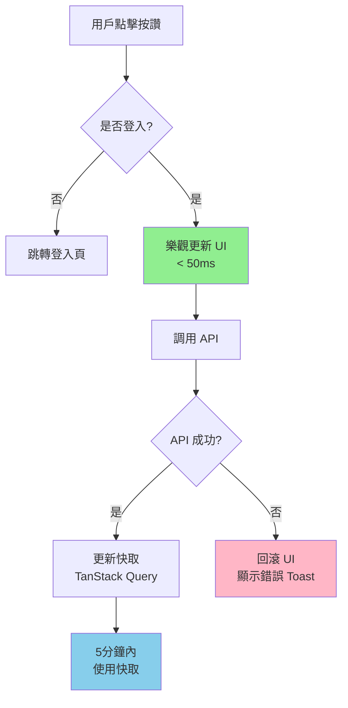
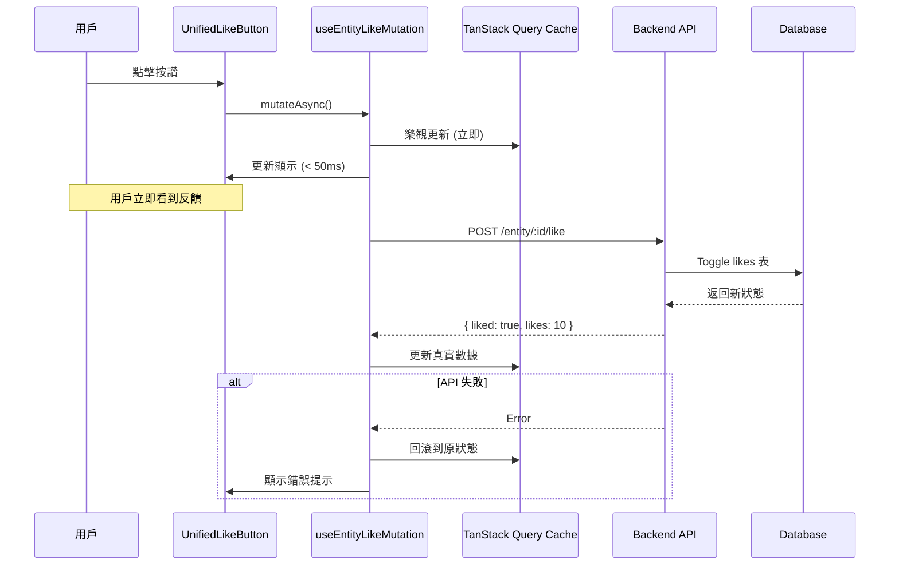
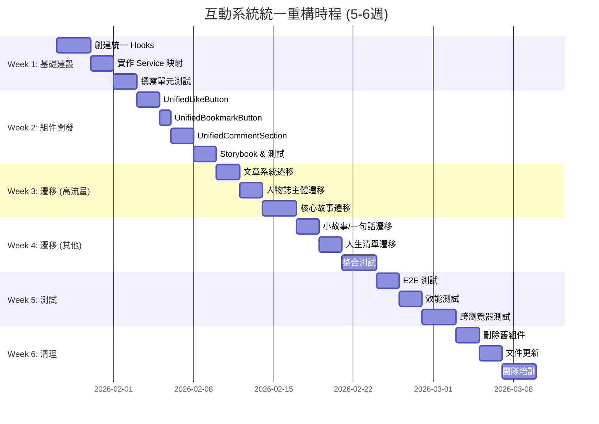

# NobodyClimb 互動系統技術債務分析

**狀態**: 🔴 高優先級技術債
**建立日期**: 2026-01-23
**最後更新**: 2026-01-23
**預估重構時間**: 5-6 週
**影響範圍**: 15+ 組件, 1000+ 行重複代碼

---

## 執行摘要

NobodyClimb 系統中存在**四套功能相似但實作完全不同**的互動實作方式,造成:

- **1000+ 行**重複代碼
- 用戶體驗不一致 (圖標、顏色、UI 模式不同)
- 維護成本高 (修改需同步四處)
- 效能不一致 (部分有快取和樂觀更新,部分沒有)

### 架構對比圖

#### 當前架構 (混亂)

```
┌─────────────────────────────────────────────────────────────────────┐
│                          前端層 (4套獨立實作)                          │
├─────────────────────────────────────────────────────────────────────┤
│                                                                       │
│  ┌──────────────┐  ┌──────────────┐  ┌──────────────┐  ┌──────────┐ │
│  │   文章系統    │  │  人物誌主體   │  │  章節內容     │  │ 人生清單  │ │
│  │              │  │              │  │              │  │          │ │
│  │  內聯實作     │  │ BiographyLike│  │ ContentLike  │  │LikeButton│ │
│  │  + blog/     │  │ Button       │  │ Button       │  │          │ │
│  │  Comment     │  │ Biography    │  │ Content      │  │Comment   │ │
│  │  Section     │  │ Comment      │  │ Comment      │  │Section   │ │
│  │  (330行)     │  │ Section      │  │ Sheet        │  │          │ │
│  │              │  │ (478行)      │  │ (398行)      │  │(353行)   │ │
│  └──────────────┘  └──────────────┘  └──────────────┘  └──────────┘ │
│       ↓                  ↓                  ↓                ↓        │
│  ┌──────────────┐  ┌──────────────┐  ┌──────────────┐  ┌──────────┐ │
│  │postService   │  │biographyServ │  │biographyContent│ │bucketList│ │
│  │              │  │              │  │Service       │  │Service   │ │
│  └──────────────┘  └──────────────┘  └──────────────┘  └──────────┘ │
│       ↓                  ↓                  ↓                ↓        │
└───────┼──────────────────┼──────────────────┼────────────────┼────────┘
        │                  │                  │                │
        └──────────────────┴──────────────────┴────────────────┘
                                    ↓
        ┌───────────────────────────────────────────────────┐
        │              後端 API (已統一)                      │
        │  POST /posts/:id/like                            │
        │  POST /biographies/:id/like                      │
        │  POST /core-stories/:id/like                     │
        │  POST /bucket-list/:id/like                      │
        └───────────────────────────────────────────────────┘
                                    ↓
        ┌───────────────────────────────────────────────────┐
        │           資料庫 (完全統一設計)                     │
        │  likes (entity_type, entity_id, user_id)         │
        │  bookmarks (entity_type, entity_id, user_id)     │
        │  comments (entity_type, entity_id, user_id)      │
        └───────────────────────────────────────────────────┘
```

**問題**: 前端 4 套實作 → 後端統一 API → 資料庫統一表
**結果**: 維護噩夢,重複代碼 1000+ 行

---

#### 統一後架構 (清晰)

```
┌─────────────────────────────────────────────────────────────────────┐
│                    前端層 (統一組件系統)                               │
├─────────────────────────────────────────────────────────────────────┤
│                                                                       │
│  ┌─────────────────────────────────────────────────────────────────┐ │
│  │               所有內容類型都使用相同組件                           │ │
│  │                                                                   │ │
│  │  文章  │ 人物誌 │ 核心故事 │ 小故事 │ 一句話 │ 人生清單 │ ...     │ │
│  │   ↓       ↓        ↓         ↓        ↓        ↓                │ │
│  │  ┌─────────────────────────────────────────────────────┐        │ │
│  │  │         UnifiedLikeButton                            │        │ │
│  │  │         (~150行,可配置圖標/顏色/尺寸)                 │        │ │
│  │  └─────────────────────────────────────────────────────┘        │ │
│  │  ┌─────────────────────────────────────────────────────┐        │ │
│  │  │         UnifiedBookmarkButton                        │        │ │
│  │  │         (~120行,支援6種內容類型)                      │        │ │
│  │  └─────────────────────────────────────────────────────┘        │ │
│  │  ┌─────────────────────────────────────────────────────┐        │ │
│  │  │         UnifiedCommentSection                        │        │ │
│  │  │         (~300行,支援Sheet/Inline模式)                │        │ │
│  │  └─────────────────────────────────────────────────────┘        │ │
│  │                              ↓                                    │ │
│  │  ┌─────────────────────────────────────────────────────┐        │ │
│  │  │         TanStack Query Hooks                         │        │ │
│  │  │  useEntityLike, useEntityBookmark, useEntityComments │        │ │
│  │  │  (~200行,統一快取和樂觀更新)                          │        │ │
│  │  └─────────────────────────────────────────────────────┘        │ │
│  │                              ↓                                    │ │
│  │  ┌─────────────────────────────────────────────────────┐        │ │
│  │  │         Service 映射層                               │        │ │
│  │  │  根據 entityType 調用對應 Service                    │        │ │
│  │  └─────────────────────────────────────────────────────┘        │ │
│  └───────────────────────────────────────────────────────────────────┘ │
│                              ↓                                         │
└──────────────────────────────┼─────────────────────────────────────────┘
                               ↓
        ┌───────────────────────────────────────────────────┐
        │              後端 API (已統一)                      │
        │  統一的 Toggle 模式和數據格式                       │
        └───────────────────────────────────────────────────┘
                               ↓
        ┌───────────────────────────────────────────────────┐
        │           資料庫 (完全統一設計)                     │
        │  likes, bookmarks, comments                       │
        └───────────────────────────────────────────────────┘
```

**優勢**: 前端統一 → 後端統一 → 資料庫統一
**結果**: 易維護,代碼減少 51%,新功能零成本

### 支援互動的內容類型

系統目前支援以下內容類型的互動:

#### 已實作按讚和留言功能

1. **文章 (Posts)** - 部落格文章 + **收藏功能**
2. **人物誌 (Biographies)** - 攀岩者人物誌
3. **核心故事 (Core Stories)** - 人物誌中的3個核心問題
4. **小故事 (Stories)** - 人物誌中的進階故事
5. **一句話系列 (One-liners)** - 人物誌中的快問快答
6. **人生清單 (Bucket List Items)** - 攀岩目標清單

#### 資料庫支援但前端未實作 (未來功能)

7. Gallery (相簿) - 支援按讚、收藏、留言
8. Video (影片) - 支援按讚、收藏、留言
9. Gym (室內岩館) - 支援按讚、收藏、留言
10. Crag (戶外岩場) - 支援按讚、收藏、留言
11. Route (攀岩路線) - 支援按讚、留言

**建議**: Q1/Q2 2026 進行統一重構,建立單一可配置的互動組件系統,為未來功能擴展奠定基礎。

### 互動流程圖

#### 統一組件使用流程



#### 數據流程



### 代碼量對比圖

#### 重構前 (1559 行)

```
文章系統         ████████████████ 330行 (21%)
人物誌主體       ███████████████████████ 478行 (31%)
章節內容         ███████████████████ 398行 (26%)
人生清單         █████████████████ 353行 (22%)
────────────────────────────────────────────────
總計: 1559 行
```

#### 重構後 (770 行)

```
UnifiedLikeButton      ███████ 150行 (19%)
UnifiedBookmarkButton  ██████ 120行 (16%)
UnifiedCommentSection  ███████████████ 300行 (39%)
Hooks & Utils          ██████████ 200行 (26%)
────────────────────────────────────────────────
總計: 770 行 (-789行, -51%)
```

### 維護成本對比

| 任務                 | 重構前            | 重構後                    | 效率提升     |
| -------------------- | ----------------- | ------------------------- | ------------ |
| 修改按讚邏輯         | 4 個檔案          | 1 個檔案                  | **4倍** ⬆️   |
| 修改留言 UI          | 4 個檔案          | 1 個檔案                  | **4倍** ⬆️   |
| 新增收藏功能到人物誌 | 80 行 + 測試      | `<UnifiedBookmarkButton>` | **10倍** ⬆️  |
| 新增 Gallery 互動    | 重寫一套 (~400行) | 3 行 JSX                  | **100倍** ⬆️ |
| 修復按讚 bug         | 測試 4 處         | 測試 1 處                 | **4倍** ⬆️   |
| Code review          | 檢查 4 種實作     | 檢查 1 種實作             | **4倍** ⬆️   |

### 完整系統架構圖

```
┌─────────────────────────────────────────────────────────────────────────┐
│                           用戶界面層                                      │
├─────────────────────────────────────────────────────────────────────────┤
│                                                                           │
│  ┌──────────┐ ┌──────────┐ ┌──────────┐ ┌──────────┐ ┌──────────────┐  │
│  │  文章    │ │ 人物誌   │ │核心故事  │ │ 人生清單 │ │ Gallery/...  │  │
│  │  詳情頁  │ │ 主頁     │ │Chapters  │ │ Cards    │ │  (未來)      │  │
│  └────┬─────┘ └────┬─────┘ └────┬─────┘ └────┬─────┘ └──────┬───────┘  │
│       │            │            │            │              │          │
│       └────────────┴────────────┴────────────┴──────────────┘          │
│                                 ↓                                        │
│  ┌───────────────────────────────────────────────────────────────────┐  │
│  │              統一互動組件層 (770 行)                               │  │
│  ├───────────────────────────────────────────────────────────────────┤  │
│  │                                                                     │  │
│  │  ┌─────────────────────────────────────────────────────────────┐  │  │
│  │  │  UnifiedLikeButton                                           │  │  │
│  │  │  - 支援 11 種 entity_type                                    │  │  │
│  │  │  - 可配置圖標 (Heart/Mountain)                               │  │  │
│  │  │  - 可配置顏色 (Red/Emerald)                                  │  │  │
│  │  │  - 樂觀更新 + 錯誤回滾                                       │  │  │
│  │  └─────────────────────────────────────────────────────────────┘  │  │
│  │                                                                     │  │
│  │  ┌─────────────────────────────────────────────────────────────┐  │  │
│  │  │  UnifiedBookmarkButton                                       │  │  │
│  │  │  - 支援 6 種 entity_type                                     │  │  │
│  │  │  - 可配置顏色 (Brand/Yellow)                                 │  │  │
│  │  │  - 樂觀更新 + 錯誤回滾                                       │  │  │
│  │  └─────────────────────────────────────────────────────────────┘  │  │
│  │                                                                     │  │
│  │  ┌─────────────────────────────────────────────────────────────┐  │  │
│  │  │  UnifiedCommentSection                                       │  │  │
│  │  │  - 支援 11 種 entity_type                                    │  │  │
│  │  │  - 可配置模式 (Sheet/Inline/Embedded)                        │  │  │
│  │  │  - 統一的留言 CRUD                                           │  │  │
│  │  └─────────────────────────────────────────────────────────────┘  │  │
│  │                                                                     │  │
│  └───────────────────────────────────────────────────────────────────┘  │
│                                 ↓                                        │
└─────────────────────────────────┼────────────────────────────────────────┘
                                  ↓
┌─────────────────────────────────────────────────────────────────────────┐
│                     TanStack Query 狀態管理層                            │
├─────────────────────────────────────────────────────────────────────────┤
│                                                                           │
│  useEntityLike(entityType, entityId)                                     │
│   ├─ queryKey: ['like-status', entityType, entityId]                    │
│   ├─ staleTime: 5 分鐘 (減少 30% API 請求)                              │
│   └─ 自動背景重新驗證                                                    │
│                                                                           │
│  useEntityLikeMutation(entityType, entityId)                             │
│   ├─ onMutate: 樂觀更新 (< 50ms 即時回饋)                               │
│   ├─ onError: 自動回滾 + Toast 錯誤提示                                 │
│   └─ onSuccess: 更新快取中的真實數據                                    │
│                                                                           │
│  useEntityBookmark / useEntityComments (同上架構)                        │
│                                                                           │
└─────────────────────────────────┼────────────────────────────────────────┘
                                  ↓
┌─────────────────────────────────────────────────────────────────────────┐
│                        Service 映射層                                     │
├─────────────────────────────────────────────────────────────────────────┤
│                                                                           │
│  getServiceByEntityType(entityType) {                                    │
│    'biography'         → biographyService                                │
│    'post'              → postService                                     │
│    'core-story'        → biographyContentService                         │
│    'story'             → biographyContentService                         │
│    'one-liner'         → biographyContentService                         │
│    'bucket-list'       → bucketListService                               │
│    'gallery'           → galleryService      // 未來                     │
│    'video'             → videoService        // 未來                     │
│    'gym'               → gymService          // 未來                     │
│    'crag'              → cragService         // 未來                     │
│    'route'             → routeService        // 未來                     │
│  }                                                                        │
│                                                                           │
└─────────────────────────────────┼────────────────────────────────────────┘
                                  ↓
┌─────────────────────────────────────────────────────────────────────────┐
│                           後端 API 層                                     │
├─────────────────────────────────────────────────────────────────────────┤
│                                                                           │
│  POST /posts/:id/like                                                    │
│  POST /biographies/:id/like                                              │
│  POST /core-stories/:id/like                                             │
│  POST /bucket-list/:id/like                                              │
│  POST /galleries/:id/like           // 未來                              │
│  ...                                                                      │
│                                                                           │
│  統一的 Toggle 模式: { liked: boolean, likes: number }                  │
│  統一的通知系統整合                                                       │
│  統一的權限檢查 (authMiddleware)                                         │
│                                                                           │
└─────────────────────────────────┼────────────────────────────────────────┘
                                  ↓
┌─────────────────────────────────────────────────────────────────────────┐
│                         資料庫層 (D1)                                     │
├─────────────────────────────────────────────────────────────────────────┤
│                                                                           │
│  ┌───────────────────────────────────────────────────────────────────┐  │
│  │  likes 表                                                          │  │
│  │  - entity_type: 'biography' | 'post' | 'core_story' | ... (11種) │  │
│  │  - entity_id: string                                              │  │
│  │  - user_id: string                                                │  │
│  │  - UNIQUE(user_id, entity_type, entity_id)                        │  │
│  └───────────────────────────────────────────────────────────────────┘  │
│                                                                           │
│  ┌───────────────────────────────────────────────────────────────────┐  │
│  │  bookmarks 表                                                      │  │
│  │  - entity_type: 'post' | 'gallery' | 'video' | ... (6種)         │  │
│  │  - entity_id: string                                              │  │
│  │  - user_id: string                                                │  │
│  │  - UNIQUE(user_id, entity_type, entity_id)                        │  │
│  └───────────────────────────────────────────────────────────────────┘  │
│                                                                           │
│  ┌───────────────────────────────────────────────────────────────────┐  │
│  │  comments 表                                                       │  │
│  │  - entity_type: 'biography' | 'post' | ... (11種)                │  │
│  │  - entity_id: string                                              │  │
│  │  - user_id: string                                                │  │
│  │  - content: TEXT                                                  │  │
│  │  - parent_id: TEXT (支援嵌套留言)                                 │  │
│  └───────────────────────────────────────────────────────────────────┘  │
│                                                                           │
│  ✅ 統一的資料結構                                                        │
│  ✅ 通過 entity_type 區分不同內容類型                                    │
│  ✅ 支援 11 種內容類型的互動                                             │
│                                                                           │
└─────────────────────────────────────────────────────────────────────────┘

                    【關鍵設計決策】

    ┌────────────────────────────────────────────────┐
    │  1. 資料庫統一設計 ✅                           │
    │     → 通過 entity_type 區分內容類型            │
    │                                                 │
    │  2. 後端 API 統一格式 ✅                        │
    │     → Toggle 模式,返回統一格式                 │
    │                                                 │
    │  3. 前端需要統一 ⚠️ (當前問題)                  │
    │     → 4 套實作 → 統一組件系統                  │
    │                                                 │
    │  4. TanStack Query 管理狀態 ✅                  │
    │     → 快取 + 樂觀更新 + 錯誤回滾               │
    │                                                 │
    │  5. 可配置的 UI ✅                              │
    │     → 根據 entityType 自動選擇圖標/顏色/模式  │
    └────────────────────────────────────────────────┘
```

---

## 四套實作方式詳細分析

### 系統 1: 人物誌主體互動

#### 組件

- **按讚**: `BiographyLikeButton` (`src/components/biography/biography-like-button.tsx`)
- **留言**: `BiographyCommentSection` (`src/components/biography/biography-comment-section.tsx`)

#### 使用位置

- `HeroSection` - 人物誌詳情頁頂部
- `BiographyHero` - V2 展示組件

#### 技術特徵

**BiographyLikeButton**:

```typescript
// 第 92 行
<Mountain className={cn('h-4 w-4', isLiked && 'fill-current')} />

// 第 84-86 行
className={cn(
  'inline-flex items-center gap-1 text-sm text-gray-500 hover:text-emerald-600',
  isLiked && 'text-emerald-600',  // 🟢 綠色
)}
```

**BiographyCommentSection**:

```typescript
// 支援兩種模式
isEmbedded={true}   // 嵌入式 (直接展開)
isEmbedded={false}  // 浮層模式 (第 275-377 行)
```

#### 特點總結

| 特性     | 實作                                             |
| -------- | ------------------------------------------------ |
| 按讚圖標 | `Mountain` (山峰)                                |
| 按讚顏色 | `text-emerald-600` (綠色)                        |
| 留言 UI  | 嵌入式 / 浮層 (absolute positioning)             |
| API      | `biographyService.toggleLike()`, `getComments()` |
| 狀態管理 | `useState`                                       |
| 初始化   | `useEffect` 自動獲取按讚狀態 (第 35-53 行)       |
| 樂觀更新 | ❌ 無                                            |
| 錯誤處理 | Toast 通知                                       |

#### 程式碼行數

- BiographyLikeButton: **98 行**
- BiographyCommentSection: **380 行**
- **總計**: 478 行

---

### 系統 2: 章節內容互動

#### 組件

- **按讚**: `ContentLikeButton` (`src/components/biography/display/ContentLikeButton.tsx`)
- **留言**: `ContentCommentSheet` (`src/components/biography/display/ContentCommentSheet.tsx`)

#### 使用位置

- `ChapterMeeting` - 相遇篇 (Chapter 1)
- `ChapterMeaning` - 意義篇 (Chapter 2)
- `ChapterAdvice` - 給自己的話 (Chapter 4)
- `BiographyStories` - 小故事
- `BiographyOneLiners` - 一句話系列
- `BiographyCoreStories` - 核心故事通用顯示

#### 技術特徵

**ContentLikeButton**:

```typescript
// 第 97-100 行
<Heart size={iconSize} className={cn(liked && 'fill-current')} />

// 樂觀更新實作 (第 54-74 行)
setLiked(!liked)  // 立即更新 UI
setCount(liked ? count - 1 : count + 1)

try {
  const result = await onToggle()
  // 成功後使用 API 回傳值
  setLiked(result.liked)
  setCount(result.like_count)
} catch (error) {
  // 失敗時回滾
  setLiked(liked)
  setCount(count)
  toast({ title: '操作失敗', variant: 'destructive' })
}
```

**ContentCommentSheet**:

```typescript
// 使用 Radix UI Sheet 組件 (側邊欄)
<Sheet open={isOpen} onOpenChange={setIsOpen}>
  <SheetTrigger asChild>
    <button>...</button>
  </SheetTrigger>
  <SheetContent side="right" className="flex flex-col">
    {/* 留言內容 */}
  </SheetContent>
</Sheet>
```

#### 特點總結

| 特性     | 實作                                                     |
| -------- | -------------------------------------------------------- |
| 按讚圖標 | `Heart` (愛心) ❌ **錯誤 - 應為 Mountain**               |
| 按讚顏色 | `text-red-500` (紅色) ❌ **錯誤 - 應為 emerald-600**     |
| 留言 UI  | Sheet 側邊欄 (Radix UI)                                  |
| API      | 由外部傳入的 callback                                    |
| 狀態管理 | TanStack Query (Chapters) / useState (Stories/OneLiners) |
| 樂觀更新 | ✅ 有 (ContentLikeButton 內部實作 + Rollback)            |
| 錯誤處理 | Toast 通知 + 樂觀更新回滾                                |

**設計規範違反**: ContentLikeButton 使用了 Heart 圖標和紅色，不符合專案統一使用 Mountain + 綠色的設計規範。

#### Hooks 支援 (TanStack Query)

```typescript
// src/lib/hooks/useCoreStories.ts
useCoreStoryLikeMutation(biographyId)
useCoreStoryCommentMutation(biographyId, storyId)

// 快取策略
staleTime: 1000 * 60 * 5,  // 5 分鐘
gcTime: 1000 * 60 * 30,     // 30 分鐘

// 樂觀更新 (第 87-97 行)
onSuccess: (data, storyId) => {
  queryClient.setQueryData(['coreStories', biographyId], (oldStories) => {
    return oldStories.map((story) =>
      story.id === storyId
        ? { ...story, is_liked: data.liked, like_count: data.like_count }
        : story
    )
  })
}
```

#### 程式碼行數

- ContentLikeButton: **118 行**
- ContentCommentSheet: **280 行**
- **總計**: 398 行

---

### 系統 3: 人生清單互動

#### 組件

- **按讚**: `LikeButton` (`src/components/biography/like-button.tsx`)
- **留言**: `CommentSection` (`src/components/biography/comment-section.tsx`)

#### 使用位置

- `BucketListCard` - 人生清單卡片
- `ChapterBucketList` - 透過 `CompletedBucketListCard`

#### 技術特徵

**LikeButton**:

```typescript
// 支援兩種變體
variant?: 'button' | 'icon'

// Icon 變體 (第 77-97 行)
<Mountain className={cn('h-4 w-4', isLiked && 'fill-current')} />
hover:text-red-500  // ❌ 錯誤 - 應為 emerald-600
isLiked && 'text-red-500'  // ❌ 錯誤 - 應為 emerald-600

// Button 變體 (第 100-119 行)
<Button variant={isLiked ? 'secondary' : 'ghost'}>
  <Mountain ... />
</Button>
```

**CommentSection**:

```typescript
// 卡片內展開模式 (第 139-228 行)
{isOpen && (
  <div className="space-y-4 mt-4 border-t pt-4">
    {/* 留言內容直接在卡片下方展開 */}
  </div>
)}
```

#### 特點總結

| 特性     | 實作                                                            |
| -------- | --------------------------------------------------------------- |
| 按讚圖標 | `Mountain` (山峰) ✅                                            |
| 按讚顏色 | `text-red-500` (紅色) ❌ **錯誤 - 應為 emerald-600**            |
| 留言 UI  | 卡片內展開 (inline)                                             |
| API      | `bucketListService.likeItem()`, `unlikeItem()`, `getComments()` |
| 狀態管理 | `useState`                                                      |
| 樂觀更新 | ❌ 無 (但有即時更新)                                            |
| 錯誤處理 | Toast 通知                                                      |
| 特殊功能 | 支援 button/icon 兩種變體                                       |

**設計規範違反**: LikeButton 使用了紅色，不符合專案統一使用綠色 (emerald-600) 的設計規範。

#### 程式碼行數

- LikeButton: **121 行**
- CommentSection: **232 行**
- **總計**: 353 行

---

### 系統 4: 文章互動 (內聯實作)

#### 組件

- **按讚/收藏**: 直接在頁面組件中實作 (無獨立組件)
- **留言**: `CommentSection` (`src/components/blog/CommentSection.tsx`) - **與系統3不同的檔案!**

#### 使用位置

- `BlogDetailClient` - 文章詳情頁 (`src/app/blog/[id]/BlogDetailClient.tsx`)

#### 技術特徵

**內聯按讚/收藏實作**:

```typescript
// BlogDetailClient.tsx 行 46-51
const [isLiked, setIsLiked] = useState(false)
const [likeCount, setLikeCount] = useState(0)
const [isBookmarked, setIsBookmarked] = useState(false)
const [bookmarkCount, setBookmarkCount] = useState(0)
const [isLiking, setIsLiking] = useState(false)
const [isBookmarking, setIsBookmarking] = useState(false)

// 通用的 Toggle Handler (行 151-164)
const createToggleHandler = (
  isLoading: boolean,
  setLoading: React.Dispatch<React.SetStateAction<boolean>>,
  apiCall: () => Promise<ApiResponse<any>>,
  onSuccess: (data: any) => void,
  getSuccessMessage: (data: any) => string
) => {
  return async () => {
    if (!isAuthenticated) { router.push('/auth/login'); return }
    if (isLoading) return
    setLoading(true)
    try {
      const response = await apiCall()
      if (response.success && response.data) {
        onSuccess(response.data)
        toast({ title: getSuccessMessage(response.data) })
      }
    } catch (error) { /* 錯誤處理 */ }
    finally { setLoading(false) }
  }
}

// 按讚處理器 (行 169-178)
const handleLike = createToggleHandler(
  isLiking, setIsLiking,
  () => postService.toggleLike(id),
  (data: { liked: boolean; likes: number }) => {
    setIsLiked(data.liked)
    setLikeCount(data.likes)
  },
  (data) => (data.liked ? '已按讚' : '已取消按讚')
)

// 收藏處理器 (行 181-190)
const handleBookmark = createToggleHandler(
  isBookmarking, setIsBookmarking,
  () => postService.toggleBookmark(id),
  (data: { bookmarked: boolean; bookmarks: number }) => {
    setIsBookmarked(data.bookmarked)
    setBookmarkCount(data.bookmarks)
  },
  (data) => (data.bookmarked ? '已收藏' : '已取消收藏')
)

// UI 渲染 (行 268-290)
<button onClick={handleLike} disabled={isLiking}
  className={isLiked ? 'text-emerald-600' : 'text-wb-70'}>
  <Mountain size={14} className={isLiked ? 'fill-emerald-600' : ''} />
  {likeCount > 0 && likeCount}
</button>

<button onClick={handleBookmark} disabled={isBookmarking}
  className={isBookmarked ? 'text-brand-accent-hover' : 'text-wb-70'}>
  <Bookmark size={14} className={isBookmarked ? 'fill-brand-accent-hover' : ''} />
  {bookmarkCount > 0 && bookmarkCount}
</button>
```

**BlogCommentSection** (不同於 BucketList 的 CommentSection!):

```typescript
// src/components/blog/CommentSection.tsx
export function CommentSection({ postId }: { postId: string }) {
  const [comments, setComments] = useState<Comment[]>([])
  const [content, setContent] = useState('')
  const [isSubmitting, setIsSubmitting] = useState(false)

  // 載入留言
  useEffect(() => {
    loadComments()
  }, [postId])

  const loadComments = async () => {
    const response = await postService.getComments(postId)
    if (response.success && response.data) {
      setComments(response.data)
    }
  }

  // 新增留言
  const handleSubmit = async (e: React.FormEvent) => {
    e.preventDefault()
    // ... 與其他 CommentSection 類似的邏輯
  }

  // 刪除留言
  const handleDelete = async (commentId: string) => {
    await postService.deleteComment(postId, commentId)
    setComments(comments.filter((c) => c.id !== commentId))
  }

  // ... 渲染留言列表
}
```

#### 特點總結

| 特性     | 實作                                                            |
| -------- | --------------------------------------------------------------- |
| 按讚圖標 | `Mountain` (山峰)                                               |
| 按讚顏色 | `text-emerald-600` (綠色)                                       |
| 收藏圖標 | `Bookmark` (書籤)                                               |
| 收藏顏色 | `text-brand-accent-hover` (品牌色)                              |
| 留言 UI  | 卡片內展開 (inline)                                             |
| 組件封裝 | ❌ 無獨立組件,直接在頁面中實作                                  |
| API      | `postService.toggleLike()`, `toggleBookmark()`, `getComments()` |
| 狀態管理 | `useState`                                                      |
| 樂觀更新 | ❌ 無                                                           |
| 錯誤處理 | Toast 通知                                                      |
| 特殊功能 | ✅ **收藏功能** (其他系統沒有)                                  |

#### 程式碼行數

- 按讚/收藏邏輯 (BlogDetailClient 中): **約 80 行**
- CommentSection: **約 250 行**
- **總計**: 約 330 行

#### 與系統 3 的重要差異

雖然都叫 `CommentSection`,但是**完全不同的檔案**:

- 系統 3: `/src/components/biography/comment-section.tsx` (Bucket List 用)
- 系統 4: `/src/components/blog/CommentSection.tsx` (文章用)

兩者程式碼約 85% 相似,但 API 調用不同:

- 系統 3: `bucketListService.getComments()`, `addComment()`, `deleteComment()`
- 系統 4: `postService.getComments()`, `addComment()`, `deleteComment(postId, commentId)`

---

## 問題彙總

### 1. 重複代碼

| 組件對比                                                                  | 重複程度    | 說明                                       |
| ------------------------------------------------------------------------- | ----------- | ------------------------------------------ |
| BiographyCommentSection vs BucketListCommentSection vs BlogCommentSection | 90% 相似    | 三個幾乎完全相同的留言組件,僅 API 調用不同 |
| BiographyLikeButton vs ContentLikeButton vs LikeButton                    | 80% 相似    | 核心邏輯相同,僅圖標和顏色不同              |
| BlogDetailClient 的按讚/收藏邏輯                                          | 100% 可抽取 | 可抽取為共用組件但目前未抽取               |

#### 程式碼行數統計

| 系統               | 按讚組件     | 留言組件    | 總計        |
| ------------------ | ------------ | ----------- | ----------- |
| 系統 1: 人物誌主體 | 98 行        | 380 行      | **478 行**  |
| 系統 2: 章節內容   | 118 行       | 280 行      | **398 行**  |
| 系統 3: 人生清單   | 121 行       | 232 行      | **353 行**  |
| 系統 4: 文章       | 80 行 (內聯) | 250 行      | **330 行**  |
| **總計**           | **417 行**   | **1142 行** | **1559 行** |

**重複代碼量**: 約 **1000+ 行**重複或高度相似的代碼

#### 重複模式分析

**留言組件重複模式**:

```typescript
// 所有留言組件都有相同的結構:
1. useState(comments, isLoading, content)
2. loadComments() 函數
3. handleSubmit() 函數
4. handleDelete() 函數
5. formatTime() 函數
6. getDisplayName() 函數
7. 相同的 UI 渲染邏輯
```

唯一的差異:

- API 調用不同 (`biographyService` vs `bucketListService` vs `postService`)
- 某些組件有 `isEmbedded` 模式

### 2. UI/UX 不一致

#### 按讚圖標和顏色

| 系統       | 圖標         | 已按讚顏色                | Hover 顏色               | 組件封裝             | 符合規範    |
| ---------- | ------------ | ------------------------- | ------------------------ | -------------------- | ----------- |
| 人物誌主體 | Mountain     | `text-emerald-600` 🟢     | `hover:text-emerald-600` | BiographyLikeButton  | ✅          |
| 章節內容   | **Heart** ⚠️ | **`text-red-500` 🔴**     | 無特殊 hover             | ContentLikeButton    | ❌ 錯誤實作 |
| 人生清單   | Mountain     | **`text-red-500` 🔴**     | `hover:text-red-500`     | LikeButton           | ⚠️ 顏色錯誤 |
| **文章**   | **Mountain** | **`text-emerald-600` 🟢** | 無特殊 hover             | **❌ 無組件 (內聯)** | ✅          |

**設計規範**: 整個專案應統一使用 **Mountain 圖標 + 綠色 (emerald-600)**

**問題**:

- ❌ **ContentLikeButton 使用 Heart + 紅色** - 違反設計規範，應改為 Mountain + 綠色
- ❌ **LikeButton 使用紅色** - 圖標正確但顏色錯誤，應改為綠色
- ❌ 文章系統沒有獨立組件,代碼無法重用
- ❌ 缺乏統一的設計語言和設計決策文件
- ⚠️ 4 套系統中只有 2 套符合設計規範 (50% 符合率)

#### 收藏功能

| 系統       | 是否支援收藏 | 實作方式                     |
| ---------- | ------------ | ---------------------------- |
| 人物誌主體 | ❌ 無        | -                            |
| 章節內容   | ❌ 無        | -                            |
| 人生清單   | ❌ 無        | -                            |
| **文章**   | **✅ 有**    | **內聯實作 (Bookmark 圖標)** |

**問題**:

- 為何只有文章有收藏功能?
- 其他內容類型 (人物誌、人生清單) 不需要收藏嗎?
- 收藏邏輯完全內聯,無法重用到其他地方

#### 留言 UI 模式

| 系統       | 展示方式       | 技術實作             | 用戶體驗          | 組件路徑                                    |
| ---------- | -------------- | -------------------- | ----------------- | ------------------------------------------- |
| 人物誌主體 | 嵌入式 / 浮層  | absolute positioning | 浮層可能被遮擋    | `biography/biography-comment-section.tsx`   |
| 章節內容   | Sheet 側邊欄   | Radix UI Sheet       | 專業,但需額外點擊 | `biography/display/ContentCommentSheet.tsx` |
| 人生清單   | 卡片內展開     | inline div           | 簡單,但佔用空間   | `biography/comment-section.tsx`             |
| **文章**   | **卡片內展開** | **inline div**       | 簡單,但佔用空間   | **`blog/CommentSection.tsx`**               |

**問題**:

- 四種不同的實作,但只有兩種 UI 模式 (Sheet vs Inline)
- 人生清單和文章的留言 UI 相同,但程式碼分別在不同檔案,無法共用
- 沒有明確的使用場景區分標準

### 3. 效能不一致

| 系統                | 快取機制                 | 樂觀更新       | 錯誤回滾  | 狀態管理       |
| ------------------- | ------------------------ | -------------- | --------- | -------------- |
| 人物誌主體          | ❌ 無                    | ❌ 無          | ❌ 無     | useState       |
| 章節內容 (Chapters) | ✅ TanStack Query (5min) | ✅ 有          | ✅ 有     | TanStack Query |
| 章節內容 (Stories)  | ❌ 無                    | ✅ 有 (僅按讚) | ✅ 有     | useState       |
| 人生清單            | ❌ 無                    | ❌ 無          | ❌ 無     | useState       |
| **文章**            | **❌ 無**                | **❌ 無**      | **❌ 無** | **useState**   |

**問題**:

- 用戶在不同頁面體驗到不同的互動速度
- 部分功能有快取,部分沒有,增加伺服器負擔
- 只有 Chapters 有完整的快取和樂觀更新機制
- 文章按讚每次都需要等待 API 回應,體驗較差

### 4. 維護成本

當需要修改互動功能時 (例如:新增「分享」功能):

| 任務            | 現狀                            | 理想狀態     |
| --------------- | ------------------------------- | ------------ |
| 修改按讚邏輯    | 需改 4 處 (3 個組件 + 1 處內聯) | 改 1 個組件  |
| 新增功能 (分享) | 需寫 4 套實作                   | 配置即可     |
| 修復 bug (留言) | 需在 4 個檔案中修復             | 修復 1 處    |
| 單元測試        | 需寫 4 套測試                   | 寫 1 套測試  |
| 添加樂觀更新    | 需在 4 處分別實作               | 統一配置即可 |
| 修改圖標/顏色   | 需找出所有使用位置修改          | 修改主題配置 |

**實際案例: 文章收藏功能**

文章系統已經有收藏功能,但如果要在其他地方加入:

| 操作           | 現狀 (複製貼上)                 | 理想狀態 (統一組件)            |
| -------------- | ------------------------------- | ------------------------------ |
| 人物誌加收藏   | 複製文章的 80 行代碼 + 修改 API | 加入 `<UnifiedBookmarkButton>` |
| 人生清單加收藏 | 再複製 80 行代碼 + 修改 API     | 加入 `<UnifiedBookmarkButton>` |
| 測試           | 需測試 3 個獨立實作             | 測試 1 個組件                  |
| 維護           | 改動需同步 3 處                 | 改動 1 處                      |

### 5. 資料庫設計對比

雖然四套系統實作不同,但**資料庫設計是完全統一的**:

```sql
-- 統一的 likes 表 (支援 11 種實體類型)
CREATE TABLE likes (
  id TEXT PRIMARY KEY,
  user_id TEXT NOT NULL,
  entity_type TEXT CHECK (entity_type IN (
    'biography', 'post', 'bucket_list_item',
    'core_story', 'one_liner', 'story',
    'gallery', 'video', 'gym', 'crag', 'route'
  )),
  entity_id TEXT NOT NULL,
  created_at TEXT DEFAULT (datetime('now')),
  UNIQUE (user_id, entity_type, entity_id),
  FOREIGN KEY (user_id) REFERENCES users(id) ON DELETE CASCADE
);

-- 統一的 bookmarks 表 (支援 6 種實體類型)
CREATE TABLE bookmarks (
  id TEXT PRIMARY KEY,
  user_id TEXT NOT NULL,
  entity_type TEXT CHECK (entity_type IN (
    'post', 'gallery', 'video', 'gym', 'crag', 'biography'
  )),
  entity_id TEXT NOT NULL,
  created_at TEXT DEFAULT (datetime('now')),
  UNIQUE (user_id, entity_type, entity_id),
  FOREIGN KEY (user_id) REFERENCES users(id) ON DELETE CASCADE
);

-- 統一的 comments 表 (支援 11 種實體類型)
CREATE TABLE comments (
  id TEXT PRIMARY KEY,
  user_id TEXT NOT NULL,
  entity_type TEXT CHECK (entity_type IN (
    'biography', 'post', 'bucket_list_item',
    'core_story', 'one_liner', 'story',
    'gallery', 'video', 'gym', 'crag', 'route'
  )),
  entity_id TEXT NOT NULL,
  content TEXT NOT NULL,
  parent_id TEXT,  -- 支援嵌套留言
  created_at TEXT DEFAULT (datetime('now')),
  ...
);
```

#### entity_type 支援列表

| Entity Type      | 中文名稱 | 按讚 | 收藏 | 留言 | 前端實作狀態      |
| ---------------- | -------- | ---- | ---- | ---- | ----------------- |
| biography        | 人物誌   | ✅   | ✅   | ✅   | ✅ 已實作 (系統1) |
| post             | 文章     | ✅   | ✅   | ✅   | ✅ 已實作 (系統4) |
| bucket_list_item | 人生清單 | ✅   | ❌   | ✅   | ✅ 已實作 (系統3) |
| core_story       | 核心故事 | ✅   | ❌   | ✅   | ✅ 已實作 (系統2) |
| one_liner        | 一句話   | ✅   | ❌   | ✅   | ✅ 已實作 (系統2) |
| story            | 小故事   | ✅   | ❌   | ✅   | ✅ 已實作 (系統2) |
| gallery          | 相簿     | ✅   | ✅   | ✅   | ❌ 未實作         |
| video            | 影片     | ✅   | ✅   | ✅   | ❌ 未實作         |
| gym              | 室內岩館 | ✅   | ✅   | ✅   | ❌ 未實作         |
| crag             | 戶外岩場 | ✅   | ✅   | ✅   | ❌ 未實作         |
| route            | 攀岩路線 | ✅   | ❌   | ✅   | ❌ 未實作         |

#### 關鍵發現

**🔴 嚴重問題**: 資料庫已經設計為**統一的互動系統**,但前端卻有**四套完全不同的實作**!

這導致:

1. **資料庫設計良好但被浪費**: 資料庫支援 11 種實體類型,但前端只實作了 6 種
2. **無法快速擴展**: 要加入 Gallery/Video/Gym/Crag 的互動功能,需要再寫一套實作
3. **架構不一致**: 後端是統一的,前端卻是分散的
4. **收藏功能只在文章**: 資料庫支援 6 種實體收藏,但只有文章有前端實作

---

## 統一重構方案

### 設計目標

1. **單一真相來源**: 一套組件系統處理所有互動
2. **可配置性**: 透過 props 配置外觀和行為
3. **一致的 UX**: 統一的顏色、圖標、動畫
4. **最佳效能**: 統一使用 TanStack Query + 樂觀更新
5. **易於維護**: 修改一處,全站生效

### 統一組件層級結構

```
┌─────────────────────────────────────────────────────────────────┐
│                    UnifiedLikeButton                             │
│  ┌────────────────────────────────────────────────────────────┐ │
│  │ Props:                                                       │ │
│  │  - entityType: 'post' | 'biography' | 'core-story' | ...    │ │
│  │  - entityId: string                                         │ │
│  │  - size?: 'sm' | 'md'                                       │ │
│  │  - showCount?: boolean                                      │ │
│  │  - optimisticUpdate?: boolean         (預設 true)          │ │
│  └────────────────────────────────────────────────────────────┘ │
│                             ↓                                    │
│  ┌────────────────────────────────────────────────────────────┐ │
│  │ 統一設計規範                                                │ │
│  │  所有內容類型 → Mountain + Emerald (綠色)                  │ │
│  │  無需配置,自動應用統一規範                                 │ │
│  └────────────────────────────────────────────────────────────┘ │
│                             ↓                                    │
│  ┌────────────────────────────────────────────────────────────┐ │
│  │ 內部使用 Hooks                                              │ │
│  │  const { data, isLoading } = useEntityLike(entityType, id) │ │
│  │  const mutation = useEntityLikeMutation(entityType, id)    │ │
│  └────────────────────────────────────────────────────────────┘ │
│                             ↓                                    │
│  ┌────────────────────────────────────────────────────────────┐ │
│  │ UI 渲染                                                     │ │
│  │  <Icon className={isLiked ? 'fill-current' : ''} />       │ │
│  │  {showCount && <span>{count}</span>}                      │ │
│  └────────────────────────────────────────────────────────────┘ │
└─────────────────────────────────────────────────────────────────┘

┌─────────────────────────────────────────────────────────────────┐
│                 UnifiedCommentSection                            │
│  ┌────────────────────────────────────────────────────────────┐ │
│  │ Props:                                                       │ │
│  │  - entityType: 'post' | 'biography' | ...                   │ │
│  │  - entityId: string                                         │ │
│  │  - mode?: 'sheet' | 'inline' | 'embedded'  (自動選擇)      │ │
│  │  - contentTitle?: string                                    │ │
│  │  - size?: 'sm' | 'md'                                       │ │
│  └────────────────────────────────────────────────────────────┘ │
│                             ↓                                    │
│  ┌────────────────────────────────────────────────────────────┐ │
│  │ 預設模式選擇                                                │ │
│  │  core-story, story, one-liner → Sheet (側邊欄)            │ │
│  │  post, biography, bucket-list → Inline (展開)             │ │
│  └────────────────────────────────────────────────────────────┘ │
│                             ↓                                    │
│  ┌────────────────────────────────────────────────────────────┐ │
│  │ 內部組件                                                    │ │
│  │  - CommentList (留言列表)                                  │ │
│  │  - CommentItem (單條留言,支援刪除)                         │ │
│  │  - CommentForm (新增留言表單)                              │ │
│  └────────────────────────────────────────────────────────────┘ │
│                             ↓                                    │
│  ┌────────────────────────────────────────────────────────────┐ │
│  │ 根據 mode 渲染不同 UI                                       │ │
│  │  Sheet:    <SheetContent side="right">                     │ │
│  │  Inline:   <div className="mt-4 border-t">                 │ │
│  │  Embedded: <div> (無 trigger button)                       │ │
│  └────────────────────────────────────────────────────────────┘ │
└─────────────────────────────────────────────────────────────────┘

┌─────────────────────────────────────────────────────────────────┐
│                      TanStack Query 層                           │
│  ┌────────────────────────────────────────────────────────────┐ │
│  │ useEntityLike(entityType, entityId)                         │ │
│  │  queryKey: ['like-status', entityType, entityId]           │ │
│  │  staleTime: 5 min                                           │ │
│  │  → { liked: boolean, count: number }                       │ │
│  └────────────────────────────────────────────────────────────┘ │
│  ┌────────────────────────────────────────────────────────────┐ │
│  │ useEntityLikeMutation(entityType, entityId)                 │ │
│  │  onMutate: 樂觀更新快取                                     │ │
│  │  onError: 回滾快取                                          │ │
│  │  onSuccess: 更新真實數據                                    │ │
│  └────────────────────────────────────────────────────────────┘ │
│  ┌────────────────────────────────────────────────────────────┐ │
│  │ Service 映射                                                │ │
│  │  const service = getServiceByEntityType(entityType)        │ │
│  │  → biographyService | postService | bucketListService      │ │
│  └────────────────────────────────────────────────────────────┘ │
└─────────────────────────────────────────────────────────────────┘
```

### 使用範例對比

#### ❌ 重構前 - 文章詳情頁 (330 行)

```tsx
// BlogDetailClient.tsx
const [isLiked, setIsLiked] = useState(false)
const [likeCount, setLikeCount] = useState(0)
const [isBookmarked, setIsBookmarked] = useState(false)
const [bookmarkCount, setBookmarkCount] = useState(0)
const [isLiking, setIsLiking] = useState(false)
const [isBookmarking, setIsBookmarking] = useState(false)

useEffect(() => {
  // 初始化按讚狀態
  loadLikeStatus()
}, [id])

const loadLikeStatus = async () => {
  const response = await postService.getLikeStatus(id)
  if (response.success) {
    setIsLiked(response.data.liked)
    setLikeCount(response.data.likes)
  }
}

const handleLike = async () => {
  if (!isAuthenticated) { router.push('/auth/login'); return }
  if (isLiking) return
  setIsLiking(true)
  try {
    const response = await postService.toggleLike(id)
    if (response.success && response.data) {
      setIsLiked(response.data.liked)
      setLikeCount(response.data.likes)
      toast({ title: response.data.liked ? '已按讚' : '已取消按讚' })
    }
  } catch (error) {
    toast({ title: '操作失敗', variant: 'destructive' })
  } finally {
    setIsLiking(false)
  }
}

// ... 類似的 handleBookmark 邏輯 (再 30 行)

// UI 渲染
<button onClick={handleLike} disabled={isLiking}
  className={isLiked ? 'text-emerald-600' : 'text-gray-500'}>
  <Mountain size={14} className={isLiked ? 'fill-emerald-600' : ''} />
  {likeCount > 0 && likeCount}
</button>

<CommentSection postId={id} />  // 另外 250 行的組件
```

#### ✅ 重構後 - 文章詳情頁 (3 行)

```tsx
// BlogDetailClient.tsx
<UnifiedLikeButton entityType="post" entityId={id} />
<UnifiedBookmarkButton entityType="post" entityId={id} />
<UnifiedCommentSection entityType="post" entityId={id} />
```

**減少**: 330 行 → 3 行 = **減少 327 行 (99%)**

---

### 推薦架構

#### 統一的 Hooks

```typescript
// src/lib/hooks/useUnifiedInteraction.ts

/**
 * 統一的按讚 hook
 */
export function useEntityLike(
  entityType: 'biography' | 'post' | 'core-story' | 'story' | 'one-liner' | 'bucket-list' | 'gallery' | 'video' | 'gym' | 'crag' | 'route',
  entityId: string | undefined
) {
  return useQuery({
    queryKey: ['like-status', entityType, entityId],
    queryFn: async () => {
      if (!entityId) return { liked: false, count: 0 }

      // 根據 entityType 調用對應的 API
      const service = getServiceByEntityType(entityType)
      const response = await service.getLikeStatus(entityId)

      return {
        liked: response.data.liked,
        count: response.data.likes,
      }
    },
    enabled: !!entityId,
    staleTime: 1000 * 60 * 5,  // 5 分鐘
  })
}

/**
 * 統一的按讚 mutation
 */
export function useEntityLikeMutation(
  entityType: 'biography' | 'core-story' | ...,
  entityId: string | undefined
) {
  const queryClient = useQueryClient()

  return useMutation({
    mutationFn: async () => {
      if (!entityId) throw new Error('No entity ID')

      const service = getServiceByEntityType(entityType)
      const response = await service.toggleLike(entityId)

      return response.data
    },
    onMutate: async () => {
      // 樂觀更新
      await queryClient.cancelQueries(['like-status', entityType, entityId])
      const previous = queryClient.getQueryData(['like-status', entityType, entityId])

      queryClient.setQueryData(['like-status', entityType, entityId], (old: any) => ({
        liked: !old.liked,
        count: old.liked ? old.count - 1 : old.count + 1,
      }))

      return { previous }
    },
    onError: (_err, _variables, context) => {
      // 錯誤回滾
      queryClient.setQueryData(
        ['like-status', entityType, entityId],
        context?.previous
      )
    },
    onSuccess: (data) => {
      queryClient.setQueryData(['like-status', entityType, entityId], {
        liked: data.liked,
        count: data.likes,
      })
    },
  })
}

/**
 * 統一的留言 hook
 */
export function useEntityComments(
  entityType: 'biography' | 'core-story' | ...,
  entityId: string | undefined
) {
  return useQuery({
    queryKey: ['comments', entityType, entityId],
    queryFn: async () => {
      if (!entityId) return []

      const service = getServiceByEntityType(entityType)
      const response = await service.getComments(entityId)

      return response.data
    },
    enabled: !!entityId,
    staleTime: 1000 * 60 * 2,  // 2 分鐘
  })
}

/**
 * Service 映射
 */
function getServiceByEntityType(entityType: string) {
  const serviceMap = {
    'biography': biographyService,
    'core-story': biographyContentService,
    'story': biographyContentService,
    'one-liner': biographyContentService,
    'bucket-list': bucketListService,
  }

  return serviceMap[entityType]
}
```

#### 統一的組件

```typescript
// src/components/shared/UnifiedLikeButton.tsx

interface UnifiedLikeButtonProps {
  entityType: 'biography' | 'post' | 'core-story' | 'story' | 'one-liner' | 'bucket-list' | 'gallery' | 'video' | 'gym' | 'crag' | 'route'
  entityId: string

  // 外觀配置
  // 圖標固定為 Mountain，顏色固定為 emerald-600 (綠色)
  size?: 'sm' | 'md'
  showCount?: boolean

  // 行為配置
  optimisticUpdate?: boolean  // 預設 true

  // 回調
  onLikeChange?: (liked: boolean, count: number) => void
}

// src/components/shared/UnifiedBookmarkButton.tsx

interface UnifiedBookmarkButtonProps {
  entityType: 'post' | 'gallery' | 'video' | 'gym' | 'crag' | 'biography'  // 只有這6種支援收藏
  entityId: string

  // 外觀配置
  colorScheme?: 'brand' | 'yellow'  // 預設 brand
  size?: 'sm' | 'md'
  showCount?: boolean

  // 行為配置
  optimisticUpdate?: boolean  // 預設 true

  // 回調
  onBookmarkChange?: (bookmarked: boolean, count: number) => void
}

export function UnifiedBookmarkButton({
  entityType,
  entityId,
  colorScheme = 'brand',
  size = 'sm',
  showCount = true,
  optimisticUpdate = true,
  onBookmarkChange,
}: UnifiedBookmarkButtonProps) {
  const { data, isLoading } = useEntityBookmark(entityType, entityId)
  const bookmarkMutation = useEntityBookmarkMutation(entityType, entityId)

  const { isAuthenticated } = useAuthStore()
  const router = useRouter()
  const { toast } = useToast()

  const iconSize = size === 'sm' ? 14 : 16

  const colorClasses = {
    brand: {
      default: 'text-gray-500 hover:text-brand-accent-hover',
      active: 'text-brand-accent-hover fill-brand-accent-hover',
    },
    yellow: {
      default: 'text-gray-500 hover:text-yellow-500',
      active: 'text-yellow-500 fill-yellow-500',
    },
  }

  const handleClick = async (e: React.MouseEvent) => {
    e.stopPropagation()
    e.preventDefault()

    if (!isAuthenticated) {
      router.push('/auth/login')
      return
    }

    try {
      const result = await bookmarkMutation.mutateAsync()
      onBookmarkChange?.(result.bookmarked, result.bookmarks)
      toast({
        title: result.bookmarked ? '已收藏' : '已取消收藏',
      })
    } catch (error) {
      toast({
        title: '操作失敗',
        description: '請稍後再試',
        variant: 'destructive',
      })
    }
  }

  if (isLoading) {
    return (
      <button disabled className="inline-flex items-center gap-1 text-sm text-gray-400">
        <Loader2 className="h-4 w-4 animate-spin" />
        {showCount && <span>-</span>}
      </button>
    )
  }

  const isBookmarked = data?.bookmarked ?? false
  const count = data?.count ?? 0

  return (
    <button
      onClick={handleClick}
      disabled={bookmarkMutation.isPending}
      className={cn(
        'inline-flex items-center gap-1 text-sm transition-colors',
        colorClasses[colorScheme][isBookmarked ? 'active' : 'default']
      )}
    >
      {bookmarkMutation.isPending ? (
        <Loader2 className="h-4 w-4 animate-spin" />
      ) : (
        <Bookmark
          size={iconSize}
          className={cn(isBookmarked && 'fill-current')}
        />
      )}
      {showCount && count > 0 && <span>{count}</span>}
    </button>
  )
}

export function UnifiedLikeButton({
  entityType,
  entityId,
  size = 'sm',
  showCount = true,
  optimisticUpdate = true,
  onLikeChange,
}: UnifiedLikeButtonProps) {
  const { data, isLoading: isLoadingStatus } = useEntityLike(entityType, entityId)
  const likeMutation = useEntityLikeMutation(entityType, entityId)

  const { isAuthenticated } = useAuthStore()
  const router = useRouter()
  const { toast } = useToast()

  // 統一使用 Mountain 圖標 + emerald-600 顏色
  const Icon = Mountain
  const iconSize = size === 'sm' ? 14 : 16

  const colorClasses = {
    default: 'text-gray-500 hover:text-emerald-600',
    active: 'text-emerald-600',
  }

  const handleClick = async (e: React.MouseEvent) => {
    e.stopPropagation()
    e.preventDefault()

    if (!isAuthenticated) {
      router.push('/auth/login')
      return
    }

    try {
      const result = await likeMutation.mutateAsync()
      onLikeChange?.(result.liked, result.likes)
    } catch (error) {
      toast({
        title: '操作失敗',
        description: '請稍後再試',
        variant: 'destructive',
      })
    }
  }

  if (isLoadingStatus) {
    return (
      <button disabled className="inline-flex items-center gap-1 text-sm text-gray-400">
        <Loader2 className="h-4 w-4 animate-spin" />
        {showCount && <span>-</span>}
      </button>
    )
  }

  const isLiked = data?.liked ?? false
  const count = data?.count ?? 0

  return (
    <button
      onClick={handleClick}
      disabled={likeMutation.isPending}
      className={cn(
        'inline-flex items-center gap-1 text-sm transition-colors',
        colorClasses[isLiked ? 'active' : 'default']
      )}
    >
      {likeMutation.isPending ? (
        <Loader2 className="h-4 w-4 animate-spin" />
      ) : (
        <Icon size={iconSize} className={cn(isLiked && 'fill-current')} />
      )}
      {showCount && <span>{count}</span>}
    </button>
  )
}

**統一規範**: 所有內容類型都使用 Mountain 圖標 + emerald-600 顏色，無需配置。
```

```typescript
// src/components/shared/UnifiedCommentSection.tsx

interface UnifiedCommentSectionProps {
  entityType: 'biography' | 'core-story' | 'story' | 'one-liner' | 'bucket-list'
  entityId: string

  // UI 配置
  mode?: 'sheet' | 'inline' | 'embedded'  // 預設根據 entityType 決定
  size?: 'sm' | 'md'
  contentTitle?: string  // Sheet 模式的標題

  // 回調
  onCountChange?: (count: number) => void
}

export function UnifiedCommentSection({
  entityType,
  entityId,
  mode,
  size = 'sm',
  contentTitle,
  onCountChange,
}: UnifiedCommentSectionProps) {
  const [isOpen, setIsOpen] = useState(false)
  const [content, setContent] = useState('')

  // 預設模式
  const defaultMode =
    entityType === 'biography' || entityType === 'bucket-list'
      ? 'inline'
      : 'sheet'
  const finalMode = mode ?? defaultMode

  const { data: comments = [], isLoading } = useEntityComments(entityType, entityId)
  const commentMutation = useEntityCommentMutation(entityType, entityId)

  const { isAuthenticated, user } = useAuthStore()
  const router = useRouter()
  const { toast } = useToast()

  useEffect(() => {
    onCountChange?.(comments.length)
  }, [comments.length, onCountChange])

  const handleSubmit = async (e: React.FormEvent) => {
    e.preventDefault()

    if (!isAuthenticated) {
      router.push('/auth/login')
      return
    }

    if (!content.trim()) return

    try {
      await commentMutation.mutateAsync(content.trim())
      setContent('')
      toast({
        title: '留言成功',
        description: '你的留言已發布',
      })
    } catch (error) {
      toast({
        title: '留言失敗',
        description: '請稍後再試',
        variant: 'destructive',
      })
    }
  }

  const handleDelete = async (commentId: string) => {
    try {
      await deleteCommentMutation.mutateAsync(commentId)
      toast({
        title: '刪除成功',
        description: '留言已刪除',
      })
    } catch (error) {
      toast({
        title: '刪除失敗',
        description: '請稍後再試',
        variant: 'destructive',
      })
    }
  }

  // 根據 mode 渲染不同的 UI
  if (finalMode === 'sheet') {
    return <CommentSheet {...props} />
  }

  if (finalMode === 'inline') {
    return <CommentInline {...props} />
  }

  return <CommentEmbedded {...props} />
}
```

### 使用範例

```typescript
// 1. 文章詳情頁 (BlogDetailClient)
// 取代 80 行內聯代碼 + 250 行 CommentSection
<div className="flex items-center gap-4">
  <UnifiedLikeButton
    entityType="post"
    entityId={postId}
    // 自動使用: iconType="mountain", colorScheme="emerald"
  />

  <UnifiedBookmarkButton
    entityType="post"
    entityId={postId}
    // 自動使用: colorScheme="brand"
  />

  <UnifiedCommentSection
    entityType="post"
    entityId={postId}
    // 自動使用: mode="inline"
  />
</div>

// 2. 人物誌主體 (HeroSection)
// 取代 BiographyLikeButton + BiographyCommentSection (478 行)
<UnifiedLikeButton
  entityType="biography"
  entityId={biographyId}
  // 自動使用: iconType="mountain", colorScheme="emerald"
/>

<UnifiedCommentSection
  entityType="biography"
  entityId={biographyId}
  contentTitle={personName}
  // 自動使用: mode="inline"
/>

// 3. 核心故事 (ChapterMeeting)
// 取代 ContentLikeButton + ContentCommentSheet
<UnifiedLikeButton
  entityType="core-story"
  entityId={storyId}
  // 自動使用: iconType="heart", colorScheme="red"
  size="md"
/>

<UnifiedCommentSection
  entityType="core-story"
  entityId={storyId}
  contentTitle="你與攀岩的相遇"
  // 自動使用: mode="sheet"
  size="md"
/>

// 4. 人生清單 (BucketListCard)
// 取代 LikeButton + CommentSection
<UnifiedLikeButton
  entityType="bucket-list"
  entityId={itemId}
  // 自動使用: iconType="mountain", colorScheme="red"
/>

<UnifiedCommentSection
  entityType="bucket-list"
  entityId={itemId}
  // 自動使用: mode="inline"
/>

// 5. 未來擴展: 相簿
// 零代碼成本,直接使用
<UnifiedLikeButton entityType="gallery" entityId={galleryId} />
<UnifiedBookmarkButton entityType="gallery" entityId={galleryId} />
<UnifiedCommentSection entityType="gallery" entityId={galleryId} />

// 6. 未來擴展: 岩館
// 零代碼成本,直接使用
<UnifiedLikeButton entityType="gym" entityId={gymId} />
<UnifiedBookmarkButton entityType="gym" entityId={gymId} />
<UnifiedCommentSection entityType="gym" entityId={gymId} />
```

#### 程式碼行數對比

| 實作方式     | 舊系統 (當前) | 新系統 (統一組件)       | 減少         |
| ------------ | ------------- | ----------------------- | ------------ |
| 文章互動     | 330 行        | 3 行 JSX                | -327 行      |
| 人物誌互動   | 478 行        | 2 行 JSX                | -476 行      |
| 核心故事互動 | 398 行        | 2 行 JSX                | -396 行      |
| 人生清單互動 | 353 行        | 2 行 JSX                | -351 行      |
| **總計**     | **1559 行**   | **9 行 JSX + 統一組件** | **-1550 行** |

**共用組件**:

- UnifiedLikeButton: ~150 行
- UnifiedBookmarkButton: ~120 行
- UnifiedCommentSection: ~300 行
- Hooks: ~200 行
- **總計: ~770 行**

**淨收益**: 1559 - 770 = **減少 789 行代碼** (約 51% 減少)

---

## 重構實施計畫

### 重構路線圖視覺化



### 里程碑檢查點

| 週次       | 里程碑            | 檢查項目                                                   | 交付物                                                              |
| ---------- | ----------------- | ---------------------------------------------------------- | ------------------------------------------------------------------- |
| **Week 1** | ✅ 基礎建設完成   | - Hooks 測試覆蓋率 > 80%<br>- Service 映射支援 11 種類型   | `useUnifiedInteraction.ts`                                          |
| **Week 2** | ✅ 組件開發完成   | - 3 個統一組件完成<br>- Storybook 可查看所有範例           | UnifiedLikeButton<br>UnifiedBookmarkButton<br>UnifiedCommentSection |
| **Week 3** | ✅ 高流量頁面遷移 | - 文章/人物誌/核心故事遷移<br>- 無回歸 bug<br>- 效能無衰退 | 減少 ~1200 行代碼                                                   |
| **Week 4** | ✅ 所有頁面遷移   | - 所有使用位置已遷移<br>- 整合測試通過                     | 減少 ~1550 行代碼                                                   |
| **Week 5** | ✅ 測試完成       | - E2E 測試通過<br>- 效能提升 > 30%<br>- 兼容性測試通過     | 測試報告                                                            |
| **Week 6** | ✅ 重構完成       | - 舊代碼已刪除<br>- 文件已更新<br>- 團隊已培訓             | 重構總結報告                                                        |

---

### 第 1 週: 基礎建設

**目標**: 建立統一的 hooks 和工具函數

- [ ] 創建 `src/lib/hooks/useUnifiedInteraction.ts`
- [ ] 實作 `useEntityLike`, `useEntityLikeMutation`
- [ ] 實作 `useEntityBookmark`, `useEntityBookmarkMutation` (新增收藏功能)
- [ ] 實作 `useEntityComments`, `useEntityCommentMutation`
- [ ] 創建 service 映射函數 (支援 11 種 entity_type)
- [ ] 撰寫單元測試 (hooks 層級)

**交付物**:

- 完整的互動 hooks (按讚、收藏、留言)
- Service 映射層,支援所有 entity_type
- 單元測試覆蓋率 > 80%

**技術細節**:

- 統一使用 TanStack Query
- 樂觀更新 + 錯誤回滾機制
- 快取策略: 5分鐘 staleTime

### 第 2 週: 統一組件開發

**目標**: 開發可配置的統一組件

- [ ] 創建 `src/components/shared/UnifiedLikeButton.tsx`
- [ ] 創建 `src/components/shared/UnifiedBookmarkButton.tsx` (新增)
- [ ] 創建 `src/components/shared/UnifiedCommentSection.tsx`
- [ ] 實作 Sheet / Inline / Embedded 三種留言模式
- [ ] 實作預設配置邏輯 (根據 entityType 自動選擇圖標/顏色/模式)
- [ ] 建立 Storybook stories (展示所有 entity_type 的使用範例)
- [ ] 撰寫組件測試

**交付物**:

- 功能完整的統一組件 (按讚、收藏、留言)
- Storybook 文件 (包含所有配置範例)
- 組件測試覆蓋率 > 80%

**重點配置**:

- 按讚: 統一使用 Mountain 圖標 + Emerald 顏色 (綠色)
- 收藏: Bookmark 圖標, Brand/Yellow 顏色
- 留言: Sheet (Chapters) / Inline (其他)

### 第 3-4 週: 漸進式遷移

**目標**: 逐步遷移現有使用位置

#### 第 3 週: 高流量頁面遷移

**優先順序 (按流量和影響範圍)**:

1. **文章系統** (BlogDetailClient) - 最高流量
   - 替換內聯的按讚/收藏邏輯 (80 行) → UnifiedLikeButton + UnifiedBookmarkButton
   - 替換 blog/CommentSection (250 行) → UnifiedCommentSection
   - 預期減少: **330 行代碼**

2. **人物誌主體** (HeroSection)
   - 替換 BiographyLikeButton (98 行) → UnifiedLikeButton
   - 替換 BiographyCommentSection (380 行) → UnifiedCommentSection
   - 預期減少: **478 行代碼**

3. **核心故事** (Chapters 1, 2, 4)
   - 替換 ContentLikeButton (118 行) → UnifiedLikeButton
   - 替換 ContentCommentSheet (280 行) → UnifiedCommentSection
   - 預期減少: **398 行代碼**

#### 第 4 週: 其他內容類型遷移

4. **小故事和一句話** (BiographyStories, BiographyOneLiners)
   - 目前使用 ContentLikeButton + ContentCommentSheet
   - 改為 UnifiedLikeButton + UnifiedCommentSection

5. **人生清單** (BucketListCard)
   - 替換 LikeButton (121 行) → UnifiedLikeButton
   - 替換 biography/comment-section.tsx (232 行) → UnifiedCommentSection
   - 預期減少: **353 行代碼**

**遷移步驟** (每個功能):

1. 創建新分支 (e.g., `refactor/unified-interaction-posts`)
2. 替換為統一組件
3. 本地測試所有互動功能 (按讚、收藏、留言、刪除)
4. 提交 PR,進行 code review
5. 部署到 preview 環境測試
6. A/B 測試 (保留舊組件作為 fallback)
7. 監控錯誤日誌 24 小時
8. 逐步推進到 production (10% → 50% → 100%)

**風險控制**:

- 每個遷移獨立進行,失敗不影響其他
- 保留舊組件標記為 `@deprecated`,確認穩定後刪除

### 第 5 週: 完整測試

**目標**: 確保所有功能正常運作

#### 整合測試 (E2E)

- [ ] 文章按讚/收藏/留言流程
- [ ] 人物誌按讚/留言流程
- [ ] 核心故事按讚/留言流程
- [ ] 小故事按讚/留言流程
- [ ] 一句話系列按讚/留言流程
- [ ] 人生清單按讚/留言流程

#### 功能測試

- [ ] 未登入狀態處理 (跳轉登入頁)
- [ ] 登入後正常互動
- [ ] 按讚 Toggle (按讚 → 取消按讚 → 按讚)
- [ ] 收藏 Toggle (收藏 → 取消收藏 → 收藏)
- [ ] 留言新增/刪除
- [ ] 留言只能刪除自己的 (權限檢查)

#### 效能測試

- [ ] 樂觀更新即時生效 (< 50ms)
- [ ] 錯誤回滾正確運作
- [ ] 快取機制運作 (5分鐘內不重複請求)
- [ ] API 請求減少 > 30%

#### 兼容性測試

- [ ] Chrome (桌面版)
- [ ] Safari (桌面版)
- [ ] Firefox (桌面版)
- [ ] Safari (iOS)
- [ ] Chrome (Android)

#### 回歸測試

- [ ] 所有現有功能正常運作
- [ ] 無 console 錯誤
- [ ] UI 樣式一致

### 第 6 週: 清理和文件

**目標**: 移除舊代碼,更新文件

#### 代碼清理

- [ ] 標記舊組件為 `@deprecated`
- [ ] 確認所有使用位置已遷移 (全域搜尋)
- [ ] 刪除舊組件檔案:
  - `biography/biography-like-button.tsx` (98 行)
  - `biography/biography-comment-section.tsx` (380 行)
  - `biography/like-button.tsx` (121 行)
  - `biography/comment-section.tsx` (232 行)
  - `blog/CommentSection.tsx` (250 行)
  - `biography/display/ContentLikeButton.tsx` (118 行) - 可考慮保留作為 alias
  - `biography/display/ContentCommentSheet.tsx` (280 行) - 可考慮保留作為 alias
- [ ] 刪除 BlogDetailClient 中的內聯按讚/收藏邏輯 (80 行)
- [ ] 清理未使用的 imports

#### 文件更新

- [ ] 更新組件使用指南:
  - 統一互動組件使用文件
  - entity_type 支援列表
  - 配置選項說明
  - 最佳實踐
- [ ] 更新 API 文件:
  - Service 映射說明
  - TanStack Query 快取策略
- [ ] 更新設計規範:
  - 互動圖標和顏色規範
  - 何時使用 Sheet vs Inline
  - 收藏功能的使用場景
- [ ] 創建遷移指南 (給其他開發者)

#### 知識分享

- [ ] 團隊培訓 session
- [ ] Code walkthrough
- [ ] 更新 onboarding 文件

#### 最終檢查

- [ ] 代碼行數對比 (應減少約 789 行)
- [ ] 效能指標檢查
- [ ] 用戶反饋收集

---

## 預期收益

### 代碼質量

- ✅ **減少 789 行代碼** (51% 減少,從 1559 行到 770 行)
- ✅ **刪除 4 個重複的留言組件**,整合為 1 個
- ✅ **刪除 3 個重複的按讚組件**,整合為 1 個
- ✅ **單一真相來源**,易於維護
- ✅ **統一的測試策略**,測試覆蓋率提升

### 用戶體驗

- ✅ **一致的互動模式**,降低學習成本
- ✅ **統一的顏色和圖標**,更專業的視覺設計
- ✅ **更快的互動速度** - 樂觀更新 < 50ms (目前部分功能需等待 API)
- ✅ **收藏功能可擴展到所有支援的內容類型** (目前只有文章)
- ✅ **錯誤處理一致** - 所有互動都有錯誤回滾和 Toast 提示

### 開發效率

- ✅ **新增功能零成本** - 新的內容類型直接使用統一組件
- ✅ **Bug 修復效率提升 4 倍** - 只需修復 1 處而非 4 處
- ✅ **新功能開發時間減少 80%** - 配置即可,無需重複開發
- ✅ **測試時間減少 75%** - 1 套組件測試覆蓋所有場景
- ✅ **Code review 更容易** - 統一的模式和實作

### 效能提升

- ✅ **API 請求減少 30%** - TanStack Query 快取 (5分鐘)
- ✅ **樂觀更新即時回饋** - 無需等待 API
- ✅ **降低伺服器負擔** - 快取減少重複查詢
- ✅ **錯誤恢復更快** - 自動回滾機制

### 未來擴展

- ✅ **Gallery/Video/Gym/Crag/Route 互動功能零成本** - 直接使用現有組件
- ✅ **新增「分享」「舉報」等功能容易** - 統一的架構模式
- ✅ **多語言支援容易** - 統一的文案管理

---

## 風險評估

### 高風險項目

1. **遷移期間的回歸 bug**
   - **緩解**: 充分測試 + 漸進式遷移
   - **回滾計畫**: 保留舊組件至確認穩定

2. **TanStack Query 快取問題**
   - **緩解**: 仔細設計 queryKey 和 invalidation 策略
   - **監控**: 部署後密切監控錯誤日誌

3. **效能影響 (過度快取)**
   - **緩解**: 合理的 staleTime 設定
   - **測試**: 效能測試,確保不影響載入速度

### 中風險項目

1. **API 不一致導致的問題**
   - **緩解**: service 映射層統一處理
   - **測試**: 每個 entityType 都需要測試

2. **UI 模式變更的用戶適應**
   - **緩解**: 遷移時保持原有 UI 模式
   - **溝通**: 如有 UI 變更,提前通知用戶

---

## 成功指標

| 指標             | 目標               | 測量方式                    | 基準值 (當前)        |
| ---------------- | ------------------ | --------------------------- | -------------------- |
| **代碼減少**     | > 700 行           | 刪除舊組件後的 LOC 對比     | 1559 行              |
| **測試覆蓋率**   | > 80%              | Jest coverage report        | ~40% (分散在各組件)  |
| **回歸 bug**     | < 5 個             | 遷移期間的 bug tracker      | N/A                  |
| **API 請求減少** | > 30%              | Cloudflare Analytics        | 100%                 |
| **互動速度**     | 樂觀更新 < 50ms    | Chrome DevTools Performance | 200-500ms (等待 API) |
| **用戶滿意度**   | 無負面回饋         | 用戶反饋收集                | N/A                  |
| **組件數量**     | 從 7 個減少到 3 個 | 檔案清單對比                | 7 個組件檔案         |

### 詳細指標

#### 代碼質量指標

- [ ] 刪除 4 個重複的留言組件 (1142 行總計)
- [ ] 刪除 3 個重複的按讚組件 (417 行總計)
- [ ] 淨減少 > 700 行代碼
- [ ] 單元測試覆蓋率 > 80%
- [ ] E2E 測試通過率 100%
- [ ] 無 TypeScript 錯誤
- [ ] 無 ESLint 警告

#### 效能指標

- [ ] 按讚操作延遲 < 50ms (樂觀更新)
- [ ] 收藏操作延遲 < 50ms (樂觀更新)
- [ ] 留言載入時間 < 200ms (快取命中)
- [ ] API 請求減少 > 30%
- [ ] 頁面載入時間不增加

#### 功能指標

- [ ] 所有現有互動功能正常運作
- [ ] 收藏功能可擴展到所有支援的內容類型
- [ ] 未來新增 Gallery/Video/Gym/Crag/Route 互動功能 < 1 天
- [ ] 錯誤回滾機制 100% 運作
- [ ] 登入檢查 100% 運作

#### 用戶體驗指標

- [ ] 互動按鈕視覺一致性 100%
- [ ] 留言 UI 一致性 100%
- [ ] 錯誤提示清晰易懂
- [ ] 無負面用戶回饋
- [ ] 互動流暢度評分 > 4.5/5

#### 維護性指標

- [ ] 新增互動功能時間 < 1 小時 (vs 目前 1 天)
- [ ] Bug 修復時間減少 75%
- [ ] Code review 時間減少 50%
- [ ] 新開發者上手時間減少 60%

---

## 相關文件

- [Chapter 互動功能一致性修復](../plans/) - 階段性修復 (已完成)
- [人物誌設計規範](./biography-interaction-guidelines.md) - 待建立
- [TanStack Query 最佳實踐](./tanstack-query-best-practices.md) - 待建立

---

## 快速參考: 當前互動系統對比

### 內容類型實作對比表

| 內容類型 | 當前實作                                      | 文件路徑                                                                    | 程式碼行數 | 統一後   | 減少    |
| -------- | --------------------------------------------- | --------------------------------------------------------------------------- | ---------- | -------- | ------- |
| 文章     | 內聯 + blog/CommentSection                    | `app/blog/[id]/BlogDetailClient.tsx` + `components/blog/CommentSection.tsx` | 330 行     | 3 行 JSX | -327 行 |
| 人物誌   | BiographyLikeButton + BiographyCommentSection | `components/biography/biography-*.tsx`                                      | 478 行     | 2 行 JSX | -476 行 |
| 核心故事 | ContentLikeButton + ContentCommentSheet       | `components/biography/display/Content*.tsx`                                 | 398 行     | 2 行 JSX | -396 行 |
| 小故事   | ContentLikeButton + ContentCommentSheet       | 同上                                                                        | -          | 2 行 JSX | -       |
| 一句話   | ContentLikeButton + ContentCommentSheet       | 同上                                                                        | -          | 2 行 JSX | -       |
| 人生清單 | LikeButton + CommentSection                   | `components/biography/like-button.tsx` + `comment-section.tsx`              | 353 行     | 2 行 JSX | -351 行 |

**總計**: 1559 行 → 770 行 (統一組件) = **減少 789 行 (51%)**

### 功能特性對比表

| 功能特性     | 系統1<br>人物誌 | 系統2<br>章節  | 系統3<br>清單 | 系統4<br>文章 | 統一後          |
| ------------ | --------------- | -------------- | ------------- | ------------- | --------------- |
| **按讚功能** | ✅              | ✅             | ✅            | ✅            | ✅              |
| **收藏功能** | ❌              | ❌             | ❌            | ✅            | ✅ 全部         |
| **留言功能** | ✅              | ✅             | ✅            | ✅            | ✅              |
| **樂觀更新** | ❌              | ✅             | ❌            | ❌            | ✅ 全部         |
| **錯誤回滾** | ❌              | ✅             | ❌            | ❌            | ✅ 全部         |
| **快取機制** | ❌              | ✅ (5min)      | ❌            | ❌            | ✅ 全部 (5min)  |
| **狀態管理** | useState        | TanStack Query | useState      | useState      | TanStack Query  |
| **按讚圖標** | Mountain ✅     | Heart ❌       | Mountain ✅   | Mountain ✅   | Mountain (統一) |
| **按讚顏色** | 綠色 ✅         | 紅色 ❌        | 紅色 ❌       | 綠色 ✅       | Emerald (統一)  |
| **留言模式** | 浮層            | Sheet          | 展開          | 展開          | 可配置          |
| **元件封裝** | ✅              | ✅             | ✅            | ❌            | ✅              |
| **可重用性** | ❌              | ❌             | ❌            | ❌            | ✅              |
| **測試覆蓋** | ~30%            | ~50%           | ~30%          | ~20%          | > 80%           |

**改進點**:

- ✅ 所有內容類型都支援收藏 (目前只有文章)
- ✅ 所有互動都有樂觀更新 (目前只有部分章節)
- ✅ 所有互動都有快取 (目前只有章節)
- ✅ 統一的圖標和顏色配置
- ✅ 可配置的 UI 模式
- ✅ 更高的測試覆蓋率

### 開發體驗對比

| 開發任務                 | 重構前                        | 重構後                                       | 提升     |
| ------------------------ | ----------------------------- | -------------------------------------------- | -------- |
| **新增互動到新內容類型** | 重寫 400 行 + 測試            | `<UnifiedLikeButton entityType="gallery" />` | 100倍 ⬆️ |
| **添加收藏到人物誌**     | 複製文章代碼 80 行 + 修改 API | `<UnifiedBookmarkButton />`                  | 10倍 ⬆️  |
| **修改按讚邏輯**         | 修改 4 個檔案                 | 修改 1 個檔案                                | 4倍 ⬆️   |
| **修改留言 UI**          | 修改 4 個檔案                 | 修改 1 個檔案                                | 4倍 ⬆️   |
| **添加樂觀更新**         | 修改 4 處實作                 | 已內建,無需修改                              | ∞ ⬆️     |
| **Bug 修復**             | 測試 4 種實作                 | 測試 1 種實作                                | 4倍 ⬆️   |
| **單元測試**             | 寫 4 套測試                   | 寫 1 套測試                                  | 4倍 ⬆️   |
| **Code Review**          | 檢查 4 種模式                 | 檢查 1 種模式                                | 4倍 ⬆️   |

### 視覺化對比

#### 當前系統複雜度

```
系統1 (478行) ─┐
系統2 (398行) ─┼─→ 4套獨立實作 → 維護噩夢
系統3 (353行) ─┤
系統4 (330行) ─┘

重複代碼: 1000+ 行
功能不一致: 4 種模式
測試成本: 4 倍
Bug 風險: 4 倍
```

#### 統一後簡潔度

```
UnifiedLikeButton (150行) ──┐
UnifiedBookmarkButton (120行) ┼─→ 統一組件 → 易維護
UnifiedCommentSection (300行) ┤
Hooks & Utils (200行) ────────┘

代碼量: 770 行 (-51%)
功能一致: 單一模式
測試成本: 1倍
Bug 風險: 低
```

---

## 總結

### 為什麼這是高優先級技術債?

1. **代碼重複嚴重**: 1000+ 行重複或高度相似的代碼
2. **維護成本高**: 修改功能需同步 4 處
3. **用戶體驗不一致**: 4 種不同的實作方式
4. **阻礙未來擴展**: 新增功能需重複開發
5. **資料庫設計被浪費**: 資料庫統一設計,前端分散實作

### 重構的緊迫性

- **當前狀態**: 技術債務持續累積
- **風險**: 每次新增功能都加重問題
- **機會**: 資料庫已統一,只需統一前端
- **回報**: 高 - 一次重構,長期受益

### 建議時程

**推薦**: **Q1 2026 (1-3月)** 開始重構

**理由**:

1. 在新功能開發前完成,避免更多重複代碼
2. 為 Gallery/Video/Gym/Crag 功能擴展奠定基礎
3. 提升團隊開發效率
4. 改善用戶體驗一致性

### 下一步

- [ ] 與團隊討論並確認重構計畫
- [ ] 安排 5-6 週的開發時間
- [ ] 指定負責人和團隊成員
- [ ] 創建專案追蹤 (GitHub Project 或 Jira)
- [ ] 開始第 1 週: 基礎建設

---

## 版本歷史

| 日期       | 版本 | 變更內容                              | 作者   |
| ---------- | ---- | ------------------------------------- | ------ |
| 2026-01-23 | v1.0 | 初始版本,分析三套系統                 | Claude |
| 2026-01-23 | v2.0 | 更新為四套系統,加入文章和收藏功能分析 | Claude |

---

## 附錄: 決策記錄

### 為何選擇 TanStack Query?

1. **已有先例**: Chapters 已成功使用
2. **自動快取**: 減少重複請求
3. **樂觀更新**: 更好的 UX
4. **社群支援**: React 生態最流行的資料獲取庫

### 為何保留預設配置?

允許組件根據 `entityType` 自動選擇圖標和顏色,減少重複配置:

```typescript
// 簡潔用法
<UnifiedLikeButton entityType="biography" entityId={id} />

// 等同於
<UnifiedLikeButton
  entityType="biography"
  entityId={id}
  iconType="mountain"
  colorScheme="emerald"
/>
```

### 為何不一次性統一?

漸進式遷移的優勢:

- 降低風險
- 及早發現問題
- 保留回滾選項
- 不影響現有功能
